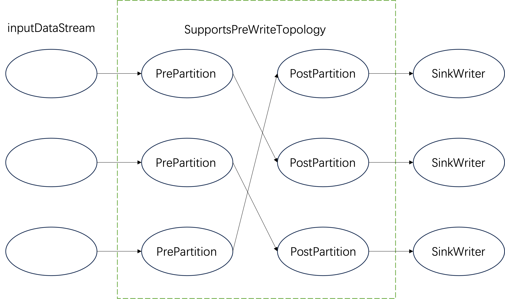
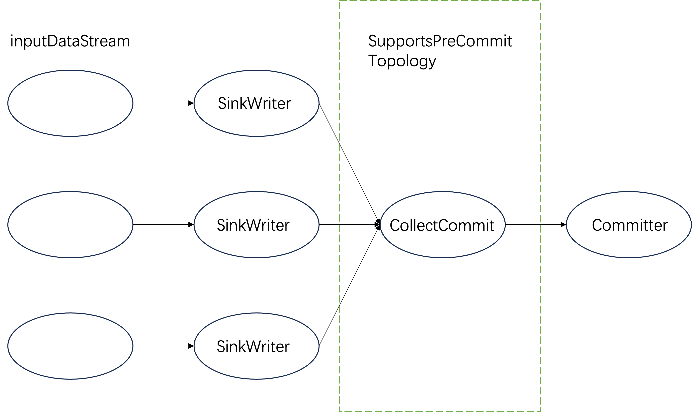
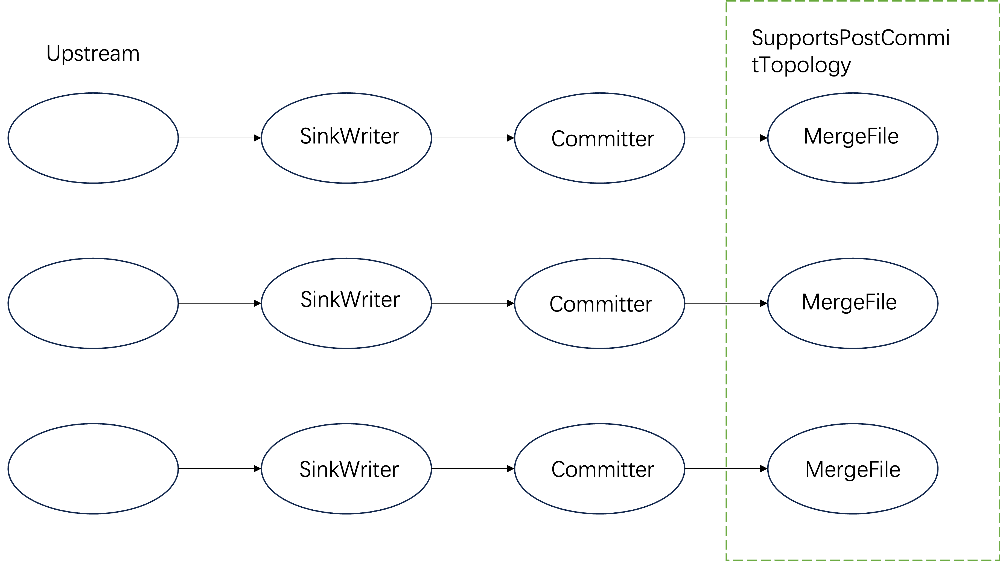

# Data Sinks

- Flink의 **Data Sink API**와 그 개념/아키텍처를 설명한다. DataStream 결과를 외부 시스템(파일, DB, 메시지 큐 등)에 기록하는 “sink”를 구현/이해하려는 경우에 읽을 내용이다.
- 이미 구현된 sink 커넥터가 필요하면 **Connector Docs**를 참고한다.

## The Data Sink API

- 새 Sink API는 주로 **FLIP-191**, **FLIP-372**에서 정의된 인터페이스를 중심으로 구성된다.
- Sink는 “factory 스타일”로, 런타임에 필요한 writer/committer 등을 생성해 파이프라인에 붙인다.

### Sink

- **Sink**는 데이터를 쓰는 컴포넌트인 **SinkWriter**를 생성하는 진입점(factory)이다.
- Sink 인스턴스는 클러스터로 전송되므로 **serializable** 해야 한다.
- 설정/구성 값은 가능하면 **eager validation**(초기에 검증)하는 것이 권장된다.

### Use the Sink

- DataStream에 sink를 붙일 때는 `DataStream.sinkTo(Sink)`를 사용한다.

```
final StreamExecutionEnvironment env = StreamExecutionEnvironment.getExecutionEnvironment();

Source mySource = new MySource(...);

DataStream<Integer> stream = env.fromSource(
        mySource,
        WatermarkStrategy.noWatermarks(),
        "MySourceName");

Sink mySink = new MySink(...);

stream.sinkTo(mySink);
```

### SinkWriter

- **SinkWriter**는 실제로 외부 시스템에 데이터를 기록하는 핵심 API다.
- 주요 메서드(3개):
    - `write(InputT element, Context context)`: 레코드를 writer에 전달(버퍼링/변환/전송 준비 포함 가능).
    - `flush(boolean endOfInput)`: **checkpoint 시점** 또는 **입력 종료 시점**에 호출되어, 대기 중인 데이터를 flush 한다.
        - `endOfInput=true`는 배치/bounded 입력 종료를 의미하며, **at-least-once**의 flush 지점을 제공한다.
        - **exactly-once**를 원하면 보통 `SupportsCommitter`를 구현해 **two-phase commit** 패턴으로 완결해야 한다.
    - `writeWatermark(Watermark watermark)`: 워터마크를 writer로 전달(다운스트림 시스템에서 watermark 처리가 필요할 때 사용).

## Advanced Sink API

- 복구/정확성/토폴로지 커스터마이징을 위해 추가 인터페이스들이 제공된다.

### SupportsWriterState

- sink가 **writer state**를 지원함을 나타낸다.
- 장애 복구(recovery)를 위해, SinkWriter는 **StatefulSinkWriter**를 구현해야 한다.
- 체크포인트에 writer 상태를 저장/복원할 수 있어, failure 후에도 안전하게 이어서 쓰기 가능해진다.

### SupportsCommitter

- **exactly-once semantics**를 **two-phase commit**으로 제공하고자 할 때 사용한다.
- 구성:
    - **CommittingSinkWriter**: checkpoint(또는 end-of-input) 때 **pre-commit**을 수행하고 **committable**(커밋에 필요한 메타/핸들)을 만든다.
    - **Committer**: 전달받은 committable을 사용해 최종 **commit**을 수행한다.
- 구현/운영 포인트:
    - Sink 자체는 serializable이어야 하며, writer/committer는 **transient**로 두고 **TaskManager의 subtask**에서 생성되는 구조가 일반적이다.
    - 체크포인트 경계에서 pre-commit → commit이 이루어져야 exactly-once가 성립한다.

## Custom sink topology

- 더 고급 요구(메시지/커밋을 특정 병렬도에서 모으기, small file merge 등)가 있으면 sink operator 토폴로지를 직접 구성할 수 있다.

### SupportsPreWriteTopology

- **SinkWriter 이전**에 사용자 정의 operator 토폴로지를 삽입할 수 있다.
- 입력 데이터를 전처리/재분배하는 용도:
    - 예: Kafka/Iceberg 같은 시스템에서 “같은 partition” 데이터를 같은 SinkWriter로 보내기 위해 **repartition** 수행.



### SupportsPreCommitTopology

- **SinkWriter 이후, Committer 이전**에 토폴로지를 삽입할 수 있다.
- committable(커밋 메시지)을 가공/재분배하는 용도:
    - 예: committable을 **1개 subtask로 collect**해서 중앙에서 커밋 처리 → 서버와의 상호작용 횟수 감소.
- 그림에서는 parallelism 변경이 표현되지만, 실제 parallelism은 사용자가 설정 가능하다.



### SupportsPostCommitTopology

- **Committer 이후**에 토폴로지를 삽입할 수 있다.
- 커밋 이후 후처리:
    - 예: 파일 기반 sink에서 **MergeFile operator**로 small files를 큰 파일로 병합해 읽기 성능 개선.

