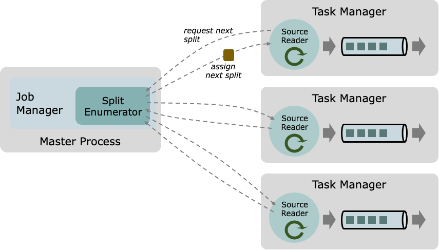
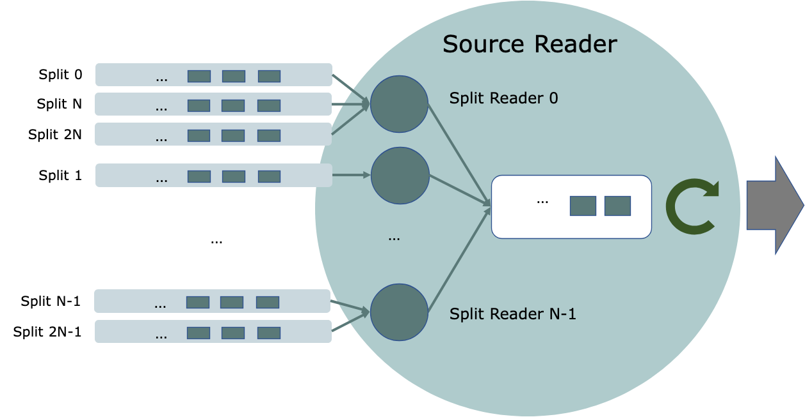
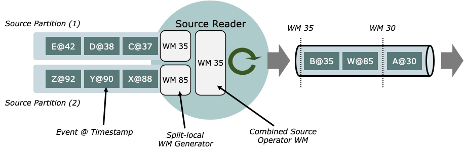

# Data Sources

Flink의 **Data Source API**(FLIP-27 기반)는 streaming(unbounded)과 batch(bounded) 소스를 **동일한 모델**로 다루기 위한 API다. Data source가
내부적으로 어떻게 동작하는지 이해하거나, 새로운 Source 커넥터를 구현하려는 경우에 유용하다. (기성 Source 커넥터는 Connector Docs 참고)

## Data Source Concepts

### Core Components

Data Source는 크게 3가지 핵심 구성요소로 나뉜다.

- **Split**: 소스가 읽는 데이터의 “조각” 단위(예: file, log partition). 병렬화/작업 분배의 최소 단위.
- **SourceReader**: Split을 **요청**받아 실제로 읽고 파싱/디코딩해 record/event를 출력한다. TaskManager의 SourceOperator 내에서 **병렬**로 실행된다.
- **SplitEnumerator**: Split을 **생성/발견**하고 SourceReader에 **할당**한다. JobManager에서 **단일 인스턴스**로 실행되며, pending split backlog를
  관리하고 균형 있게 분배한다.
- **Source**: 위 컴포넌트들을 묶는 API 엔트리 포인트(팩토리 역할).



### Unified Across Streaming and Batch

- **bounded(batch)**: enumerator가 **고정된** split 집합을 만들고, 각 split은 **유한(finite)** 하다.
- **unbounded(streaming)**: (1) split이 유한하지 않거나, (2) enumerator가 **새 split을 계속 생성**한다.

### Split Reassignment On Recovery

- 기본 동작: 정상 상황에서 enumerator가 할당한 split은 다른 reader로 재할당되지 않는다. 장애 복구 시에는 saved state 기반으로 split이 원래 reader에 “즉시” 돌아간다.
- **SupportsSplitReassignmentOnRecovery** 구현 시: 복구 과정에서 split을 reader로 곧바로 돌려주지 않고, **모든 split을 SplitEnumerator로 회수**한 뒤
  enumerator가 **재분배**한다. (가용 reader 상황을 반영해 균형 잡힌 복구 가능)

## Examples

### Bounded File Source (개념 예시)

- Source 입력: directory path + Format(파서)
- Split: file 또는 file region(포맷이 split 가능하면)
- SplitEnumerator: directory의 파일 목록 → 요청하는 reader에 split 할당 → 끝나면 **NoMoreSplits** 반환
- SourceReader: split을 읽고 Format으로 파싱 → NoMoreSplits 받으면 종료

### Unbounded Streaming File Source (개념 예시)

- 위와 동일하되 enumerator가 **NoMoreSplits를 반환하지 않고**, 주기적으로 directory를 스캔해 **새 파일 발견 시 새 split 생성/할당**한다.

### Unbounded Streaming Kafka Source (개념 예시)

- Source 입력: Topic(들/regex) + Deserializer
- Split: Kafka **Topic Partition**
- SplitEnumerator: broker에 접속해 partitions를 나열(옵션으로 재탐색해 신규 topic/partition 발견)
- SourceReader: KafkaConsumer로 partition을 읽고 Deserializer로 decode. partition에는 “끝”이 없어서 reader도 종료되지 않는다.

### Bounded Kafka Source (개념 예시)

- Split(Topic Partition)에 **end offset**이 존재한다.
- SourceReader가 end offset까지 도달하면 split 종료, 모든 split이 끝나면 reader 종료.

## The Data Source API

### Source

Source는 팩토리 스타일 인터페이스로 다음 컴포넌트를 생성한다.

- SplitEnumerator
- SourceReader
- Split Serializer
- Enumerator Checkpoint Serializer

또한 Source는 **boundedness** 속성을 제공해 Flink가 적절한 실행 모드를 선택할 수 있게 한다.  
Source 인스턴스는 런타임에 클러스터로 직렬화되어 업로드되므로 **serializable**해야 한다.

### SplitEnumerator

SplitEnumerator는 Source의 “brain” 역할을 하며 보통 다음을 담당한다.

- SourceReader **등록 처리**
- SourceReader **장애 처리**
    - reader 실패 시 `addSplitsBack()` 호출: 실패 reader에 할당됐지만 **ack되지 않은 split**을 회수/재할당
- **SourceEvent** 처리
    - enumerator ↔ reader 간 커스텀 이벤트로 정교한 coordination 가능
- **Split discovery & assignment**
    - 새 split 발견, reader 등록/복구, reader 실패 등 이벤트에 반응해 split 할당

SplitEnumerator는 `SplitEnumeratorContext`를 통해 현재 parallelism, reader 정보 조회, split 할당, 비동기 작업 스케줄링 등을 수행한다.  
일부 enumerator는 주기적 split discovery 같은 “능동적” 작업이 필요할 수 있는데, 이때 `callAsync()`를 활용하면 **자체 스레드 관리 없이** 수행 가능하다.

```java
class MySplitEnumerator implements SplitEnumerator<MySplit, MyCheckpoint> {
    private final long DISCOVER_INTERVAL = 60_000L;
    private final SplitEnumeratorContext<MySplit> enumContext;

    MySplitEnumerator(SplitEnumeratorContext<MySplit> enumContext) {
        this.enumContext = enumContext;
    }

    private List<MySplit> discoverSplits() { /* ... */ }

    @Override
    public void start() {
        enumContext.callAsync(
                this::discoverSplits,
                (splits, thrown) -> {
                    Map<Integer, List<MySplit>> assignments = new HashMap<>();
                    int p = enumContext.currentParallelism();
                    for (MySplit s : splits) {
                        int owner = s.splitId().hashCode() % p;
                        assignments.computeIfAbsent(owner, k -> new ArrayList<>()).add(s);
                    }
                    enumContext.assignSplits(new SplitsAssignment<>(assignments));
                },
                0L, DISCOVER_INTERVAL
        );
    }
}
```

### SourceReader

SourceReader는 TaskManager에서 split을 소비하며, **pull-based** 인터페이스를 제공한다. Task는 루프에서 `pollNext(ReaderOutput)`를 호출해 레코드를 끌어온다.

`pollNext()`의 반환 상태:

- **MORE_AVAILABLE**: 즉시 더 읽을 레코드가 있음
- **NOTHING_AVAILABLE**: 지금은 없지만 미래에 생길 수 있음
- **END_OF_INPUT**: 모든 레코드 소진(종료 가능)

성능 측면에서 `ReaderOutput`은 한 번의 `pollNext()`에서 여러 레코드를 내보낼 수 있도록 하지만, task thread는 event-loop로 동작하므로 **불필요한 다중 emit/블로킹을
피하는 것이 권장**된다.

State 관리:

- SourceReader의 상태는 `snapshotState()`에서 반환되는 **SourceSplits 내부**에 유지하는 것이 권장된다.
- 그래야 split이 다른 reader로 재할당될 때 state가 함께 이동할 수 있다.

Coordination:

- `SourceReaderContext`로 SplitEnumerator에 **SourceEvent**를 보낼 수 있다.
- 흔한 패턴: reader가 로컬 정보를 보고하고, 전역 뷰를 가진 enumerator가 결정을 내린다.

개발 팁:

- SourceReader를 바닥부터 구현하기보다, Flink가 제공하는 **SourceReaderBase** 사용이 권장된다(동기/블로킹 I/O를 안전하게 감싸주는 구현 포함). 자세한 내용은 Split
  Reader API 참고.

### Use the Source

DataStream을 만들려면 `StreamExecutionEnvironment.fromSource()`에 Source와 WatermarkStrategy를 넘긴다.

```
final StreamExecutionEnvironment env = StreamExecutionEnvironment.getExecutionEnvironment();
Source<Integer, ?, ?> mySource = new MySource(...);

DataStream<Integer> stream = env.fromSource(
  mySource,
  WatermarkStrategy.noWatermarks(),
  "MySourceName"
);
```

## Split Reader API

### 왜 필요한가

핵심 SourceReader API는 **완전 비동기** 모델이라 split 읽기를 비동기로 직접 관리해야 한다.  
하지만 실전 소스들은 KafkaConsumer의 blocking poll, HDFS/S3 같은 blocking I/O 등 **동기/블로킹** 호출을 많이 사용한다.

따라서 보통은:

- blocking I/O는 별도 fetcher thread에서 수행
- 결과를 비동기 SourceReader 쪽으로 handover

이 구현을 쉽게 하기 위해 **SplitReader + SourceReaderBase** 조합이 제공된다.

### SplitReader

SplitReader API는 단순하며, 보통 아래 3가지 메서드 형태로 구성된다.

- blocking fetch → `RecordsWithSplitIds` 반환
- split 변경 처리(Non-blocking)
- blocking fetch를 깨우는 wakeup(Non-blocking)

SplitReader는 외부 시스템에서 “읽기” 자체에 집중하므로 SourceReader보다 단순하다.

### SourceReaderBase

SourceReaderBase는 커넥터 구현자가 반복적으로 겪는 작업을 “기본 제공”한다.

- fetcher thread pool 관리
- fetcher thread ↔ `pollNext()` 동기화
- per-split watermark 유지(정렬/정합)
- checkpoint를 위한 per-split state 유지
- record emission rate limiting
- 등등

Rate limiting은 `RateLimiterStrategy`로 적용 가능하며 기본은 비활성이다.

### SplitFetcherManager

SourceReaderBase는 `SplitFetcherManager`의 동작에 따라 여러 threading model을 지원한다. 예를 들어 “fixed-size fetcher pool + splitId 해시 기반
분배” 같은 모델을 만들 수 있다.



```java
public class FixedSizeSplitFetcherManager<E, SplitT extends SourceSplit>
        extends SplitFetcherManager<E, SplitT> {

    private final int numFetchers;

    public FixedSizeSplitFetcherManager(
            int numFetchers,
            Supplier<SplitReader<E, SplitT>> splitReaderSupplier,
            Configuration config) {
        super(splitReaderSupplier, config);
        this.numFetchers = numFetchers;
        for (int i = 0; i < numFetchers; i++) {
            startFetcher(createSplitFetcher());
        }
    }

    @Override
    public void addSplits(List<SplitT> splitsToAdd) {
        Map<Integer, List<SplitT>> byFetcher = new HashMap<>();
        splitsToAdd.forEach(split -> {
            int idx = split.hashCode() % numFetchers;
            byFetcher.computeIfAbsent(idx, k -> new ArrayList<>()).add(split);
        });
        byFetcher.forEach((idx, splits) -> fetchers.get(idx).addSplits(splits));
    }
}
```

```java
public class FixedFetcherSizeSourceReader<E, T, SplitT extends SourceSplit, SplitStateT>
        extends SourceReaderBase<E, T, SplitT, SplitStateT> {

    public FixedFetcherSizeSourceReader(
            Supplier<SplitReader<E, SplitT>> splitFetcherSupplier,
            RecordEmitter<E, T, SplitStateT> recordEmitter,
            Configuration config,
            SourceReaderContext context) {

        super(
                new FixedSizeSplitFetcherManager<>(
                        config.get(SourceConfig.NUM_FETCHERS),
                        splitFetcherSupplier,
                        config),
                recordEmitter,
                config,
                context
        );
    }

    @Override
    protected void onSplitFinished(Map<String, SplitStateT> finishedSplitIds) { /* ... */ }

    @Override
    protected SplitStateT initializedState(SplitT split) { /* ... */ }

    @Override
    protected SplitT toSplitType(String splitId, SplitStateT splitState) { /* ... */ }
}
```

## Event Time and Watermarks

### API

Event time timestamp assignment과 watermark generation은 data source의 일부로 동작한다.  
DataStream API에서 `WatermarkStrategy`를 `fromSource()`에 넘기면, 내부적으로 `TimestampAssigner`와 `WatermarkGenerator`를 만든다.

```
environment.fromSource(
  Source<OUT, ?, ?> source,
  WatermarkStrategy<OUT> timestampsAndWatermarks,
  String sourceName
);
```

TimestampAssigner/WatermarkGenerator는 ReaderOutput(SourceOutput) 내부에서 투명하게 실행되므로, source implementor가 직접
timestamp/watermark 로직을 구현할 필요는 없다.

### Event Timestamps (2-step)

1) SourceReader가 source record timestamp가 있는 경우(예: Kafka/Kinesis/Pulsar/Pravega)  
   `SourceOutput.collect(event, timestamp)`로 **source record timestamp**를 이벤트에 부착한다.
2) 애플리케이션이 설정한 `TimestampAssigner`가 최종 event timestamp를 결정한다.
    - assigner는 source record timestamp와 event 모두를 보고 최종 timestamp를 계산할 수 있다.
    - 소스 시스템 timestamp와 payload 내 timestamp 중 무엇을 event time으로 쓸지 선택 가능.

주의:

- file source처럼 source record timestamp가 없는 경우, “source record timestamp”를 최종 timestamp로 선택하면 **LONG_MIN**(
  =-9,223,372,036,854,775,808) 같은 기본값이 될 수 있다.

### Watermark Generation

- **streaming 실행에서만 활성**이고, batch 실행에서는 watermark generator가 비활성(no-op)이다.
- Data Source API는 **split별 watermark generator**를 지원한다.
    - split 간 event time skew를 관찰해, idle split이 전체 event time 진행을 막는 문제를 완화.
- Split Reader API 기반 구현은 split-aware watermarks를 **기본 제공**한다.
- 더 낮은 레벨의 SourceReader API를 직접 구현할 경우, 서로 다른 split의 이벤트를 **split-local SourceOutput**으로 분리 출력해야 split-aware watermark가
  가능하다.
    - `createOutputForSplit(splitId)` / `releaseOutputForSplit(splitId)` 사용.



### Split Level Watermark Alignment

Flink runtime이 operator watermark alignment를 처리하더라도, split 수준 정렬을 위해서는 source가 추가로 다음을 구현해야 한다.

- `SourceReader#pauseOrResumeSplits`
- `SplitReader#pauseOrResumeSplits`

기본 구현은 `UnsupportedOperationException`을 던질 수 있으며,
`pipeline.watermark-alignment.allow-unaligned-source-splits=false`이고
(한 reader에) 여러 split이 할당된 상태에서 watermark alignment threshold를 초과하면 문제가 될 수 있다.

개발 팁:

- SourceReaderBase는 `SourceReader#pauseOrResumeSplits` 구현을 포함한다.
- 따라서 상속 기반 구현은 보통 `SplitReader#pauseOrResumeSplits`만 구현하면 된다.
