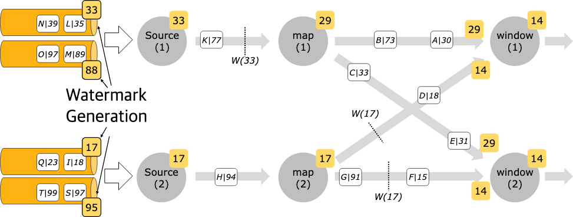

# Generating Watermarks #

## Watermark Strategy 소개

### 이벤트 타임을 위한 필수 요소

- 이벤트 타임 처리를 위해 Flink는 각 이벤트의 **event timestamp**를 알아야 하며, 보통 `TimestampAssigner`로 이벤트 필드에서 타임스탬프를 추출한다.
- 타임스탬프 할당과 함께 **watermark 생성**이 필요하다. watermark는 시스템에 “이벤트 타임 진행 상황”을 알려준다.
- Flink는 `TimestampAssigner` + `WatermarkGenerator`를 함께 담은 **`WatermarkStrategy`** 를 사용한다.
    - `WatermarkStrategy`에는 공통 전략을 위한 정적 헬퍼가 제공되며, 필요 시 커스텀 조합도 가능하다.
- 주의: 타임스탬프/워터마크는 **1970-01-01T00:00:00Z 기준 epoch millisecond**로 표현된다.
- `TimestampAssigner` 지정은 선택이며, Kafka/Kinesis 같은 소스는 레코드 자체의 타임스탬프를 그대로 쓰는 경우가 많다.

```java
public interface WatermarkStrategy<T>
        extends TimestampAssignerSupplier<T>,
        WatermarkGeneratorSupplier<T> {

    /**
     * Instantiates a {@link TimestampAssigner} for assigning timestamps according to this
     * strategy.
     */
    @Override
    TimestampAssigner<T> createTimestampAssigner(TimestampAssignerSupplier.Context context);

    /**
     * Instantiates a WatermarkGenerator that generates watermarks according to this strategy.
     */
    @Override
    WatermarkGenerator<T> createWatermarkGenerator(WatermarkGeneratorSupplier.Context context);
}
```

## Watermark Strategy 적용 위치

### 소스에 직접 적용(권장)

- `WatermarkStrategy`는
    1) **source에 직접**, 또는
    2) **non-source 연산 이후**
       적용할 수 있다.
- **소스에 직접 적용하는 것이 더 정확**한 워터마크를 만들기 유리하다.
    - 파티션/샤드/스플릿 단위 정보를 활용해 더 세밀하게 워터마크를 추적할 수 있기 때문.

```
final StreamExecutionEnvironment env = StreamExecutionEnvironment.getExecutionEnvironment();

DataStream<MyEvent> stream = env.readFile(
        myFormat, myFilePath, FileProcessingMode.PROCESS_CONTINUOUSLY, 100,
        FilePathFilter.createDefaultFilter(), typeInfo);

// Apply watermark strategy at the source
DataStream<MyEvent> withTimestampsAndWatermarks = stream
        .filter( event -> event.severity() == WARNING )
        .assignTimestampsAndWatermarks(<watermark strategy>);

// Continue with event-time based operations
withTimestampsAndWatermarks
        .keyBy( (event) -> event.getGroup() )
        .window(TumblingEventTimeWindows.of(Duration.ofSeconds(10)))
        .reduce( (a, b) -> a.add(b) )
        .addSink(...);
```

### 소스 뒤에서 적용(차선책)

- 소스에서 설정이 불가한 경우에만, 스트림 중간에서 `assignTimestampsAndWatermarks(...)`로 적용한다.
- 이 방식은 기존 스트림에 타임스탬프/워터마크가 있어도 **TimestampAssigner가 덮어쓴다**.

## Idle Source 처리

### 워터마크가 멈추는 문제

- 특정 파티션/스플릿이 한동안 이벤트를 내지 않으면(`idle`) 워터마크 생성에 새 정보가 없어지고,
- 전체 워터마크가 **모든 병렬 입력 워터마크의 최소값**으로 계산되기 때문에, 일부 입력이 idle이면 전체 진행이 **발목 잡힐 수 있다**.
- 해결: idleness 감지 후 입력을 idle로 마킹하는 전략 사용
    - 예: `withIdleness(Duration.ofMinutes(1))`

```
WatermarkStrategy
        .<Tuple2<Long, String>>forBoundedOutOfOrderness(Duration.ofSeconds(20))
        .withIdleness(Duration.ofMinutes(1));
```

## Watermark Alignment

### 너무 빠른 입력이 만드는 상태 폭증 문제

- 반대로 어떤 입력이 너무 빨리 처리되어 워터마크를 급격히 올리면,
    - downstream 연산(윈도 조인/집계 등)은 “느린 입력” 때문에 최소 워터마크가 낮게 유지되어
    - “빠른 입력”에서 온 레코드를 오래 **버퍼링/상태로 적재**해야 해 상태가 비정상적으로 커질 수 있다.

````
WatermarkStrategy
        .<Tuple2<Long, String>>forBoundedOutOfOrderness(Duration.ofSeconds(20))
        .withWatermarkAlignment("alignment-group-1", Duration.ofSeconds(20), Duration.ofSeconds(1));
````

- 해결: **watermark alignment**를 켜서, 특정 입력이 다른 입력들보다 워터마크를 너무 앞서 올리지 못하게 제한한다.
    - 그룹 라벨(예: `alignment-group-1`)로 정렬 대상 소스들을 묶고
    - 허용 드리프트(최소 워터마크 대비 최대 선행 정도)와
    - 갱신 주기를 설정한다.
- 동작 방식: 너무 앞서간 소스/태스크의 소비를 **일시 정지(pause)** 하고, 다른 입력들이 따라오면 재개(resume)한다.
- 제약:
    - **FLIP-27 소스에서만** 가능(레거시 소스/소스 이후 적용 시 동작 안 함).
    - Flink 1.17 기준으로 **split-level alignment** 지원(커넥터가 split pause/resume 인터페이스 구현 필요).
    - 업그레이드(1.15~1.16) 시 호환 이슈가 있으면 `pipeline.watermark-alignment.allow-unaligned-source-splits=true`로 split-level
      alignment를 끌 수 있다.
    - split 개수와 source 병렬도가 다르면(한 서브태스크가 여러 파티션을 맡으면) 워터마크 동작이 기대와 달라질 수 있다.
- 또한 동일 소스 내 태스크 간, 혹은 **서로 다른 소스(Kafka+File 등) 간**에도 alignment가 가능해 워터마크 속도 차이를 완화한다.

## WatermarkGenerator 작성

### 인터페이스와 두 가지 스타일

```java
/**
 * The {@code WatermarkGenerator} generates watermarks either based on events or
 * periodically (in a fixed interval).
 *
 * <p><b>Note:</b> This WatermarkGenerator subsumes the previous distinction between the
 * {@code AssignerWithPunctuatedWatermarks} and the {@code AssignerWithPeriodicWatermarks}.
 */
@Public
public interface WatermarkGenerator<T> {

    /**
     * Called for every event, allows the watermark generator to examine 
     * and remember the event timestamps, or to emit a watermark based on
     * the event itself.
     */
    void onEvent(T event, long eventTimestamp, WatermarkOutput output);

    /**
     * Called periodically, and might emit a new watermark, or not.
     *
     * <p>The interval in which this method is called and Watermarks 
     * are generated depends on {@link ExecutionConfig#getAutoWatermarkInterval()}.
     */
    void onPeriodicEmit(WatermarkOutput output);
}
```

- `WatermarkGenerator`는 두 콜백으로 구성된다.
    - `onEvent(...)`: 이벤트마다 호출(타임스탬프 관찰/기억, 또는 즉시 워터마크 발행 가능)
    - `onPeriodicEmit(...)`: 주기적으로 호출(설정된 자동 워터마크 간격에 따름)
- 스타일 2가지:
    - **Periodic**: `onEvent`로 관찰하고, `onPeriodicEmit` 시점에 워터마크를 발행
    - **Punctuated**: 특정 “마커 이벤트”를 만나면 `onEvent`에서 즉시 발행(보통 `onPeriodicEmit`은 사용 안 함)
- 자동 발행 주기(Periodic 호출 간격)는 `ExecutionConfig.setAutoWatermarkInterval(...)`로 설정한다.
- 워터마크를 이벤트마다 과도하게 발행할 수도 있지만, 워터마크는 downstream 연산을 유발하므로 **너무 많으면 성능 저하**가 발생한다.

### Periodic 예시(개념)

```java
/**
 * This generator generates watermarks assuming that elements arrive out of order,
 * but only to a certain degree. The latest elements for a certain timestamp t will arrive
 * at most n milliseconds after the earliest elements for timestamp t.
 */
public class BoundedOutOfOrdernessGenerator implements WatermarkGenerator<MyEvent> {

    private final long maxOutOfOrderness = 3500; // 3.5 seconds

    private long currentMaxTimestamp;

    @Override
    public void onEvent(MyEvent event, long eventTimestamp, WatermarkOutput output) {
        currentMaxTimestamp = Math.max(currentMaxTimestamp, eventTimestamp);
    }

    @Override
    public void onPeriodicEmit(WatermarkOutput output) {
        // emit the watermark as current highest timestamp minus the out-of-orderness bound
        output.emitWatermark(new Watermark(currentMaxTimestamp - maxOutOfOrderness - 1));
    }

}

/**
 * This generator generates watermarks that are lagging behind processing time 
 * by a fixed amount. It assumes that elements arrive in Flink after a bounded delay.
 */
public class TimeLagWatermarkGenerator implements WatermarkGenerator<MyEvent> {

    private final long maxTimeLag = 5000; // 5 seconds

    @Override
    public void onEvent(MyEvent event, long eventTimestamp, WatermarkOutput output) {
        // don't need to do anything because we work on processing time
    }

    @Override
    public void onPeriodicEmit(WatermarkOutput output) {
        output.emitWatermark(new Watermark(System.currentTimeMillis() - maxTimeLag));
    }
}
```

- **Bounded out-of-orderness**:
    - 지금까지 본 최대 이벤트 타임스탬프를 추적하고
    - `maxTimestamp - 허용 지연 - 1` 형태로 워터마크를 주기적으로 발행
    - Flink에는 유사한 내장 구현(`BoundedOutOfOrdernessWatermarks`)이 존재
- **Processing time lag**:
    - 이벤트 타임 대신 처리시간 기준으로 `currentTimeMillis - 지연` 워터마크를 주기 발행
    - 입력이 Flink에 도달하는 지연이 bounded라고 가정하는 방식

### Punctuated 예시(개념)

- 이벤트가 워터마크 마커를 포함하면 그 이벤트에 담긴 타임스탬프로 즉시 워터마크를 발행
- 주기 발행은 불필요

```java
public class PunctuatedAssigner implements WatermarkGenerator<MyEvent> {

    @Override
    public void onEvent(MyEvent event, long eventTimestamp, WatermarkOutput output) {
        if (event.hasWatermarkMarker()) {
            output.emitWatermark(new Watermark(event.getWatermarkTimestamp()));
        }
    }

    @Override
    public void onPeriodicEmit(WatermarkOutput output) {
        // don't need to do anything because we emit in reaction to events above
    }
}

```

## Kafka 커넥터와 워터마크 전략



### 파티션 인지(per-partition) 워터마크

```java
KafkaSource<String> kafkaSource = KafkaSource.<String>builder()
        .setBootstrapServers(brokers)
        .setTopics("my-topic")
        .setGroupId("my-group")
        .setStartingOffsets(OffsetsInitializer.earliest())
        .setValueOnlyDeserializer(new SimpleStringSchema())
        .build();

DataStream<String> stream = env.fromSource(
        kafkaSource, WatermarkStrategy.forBoundedOutOfOrderness(Duration.ofSeconds(20)), "mySource");
```

- Kafka는 파티션별로는 타임스탬프가 단조 증가하거나 bounded out-of-order 패턴을 가질 수 있지만,
- 여러 파티션을 병렬 소비하면 이벤트가 섞여(per consumer interleaving) 파티션별 패턴이 깨질 수 있다.
- 이를 위해 Flink는 **Kafka 파티션 인지 워터마크 생성**을 지원한다.
    - Kafka consumer 내부에서 **파티션별 워터마크를 생성**하고,
    - 셔플 시 워터마크 병합 규칙과 동일하게 파티션 워터마크를 합쳐 전체 워터마크를 만든다.
- 파티션별 타임스탬프가 엄격히 증가한다면, 파티션별 ascending 워터마크로 **매우 정확한 전체 워터마크**를 얻을 수 있다.
- Kafka 예시에서는 TimestampAssigner를 주지 않아도 Kafka 레코드의 타임스탬프를 그대로 사용 가능하다.

## 오퍼레이터의 워터마크 처리 규칙

### “워터마크 먼저 처리 후 전달”

- 일반 규칙: 오퍼레이터는 특정 워터마크를 downstream으로 보내기 전에,
    - 그 워터마크로 인해 트리거되어야 하는 계산(예: 윈도우 종료/발화)을 **먼저 모두 수행**하고,
    - 그 결과를 출력한 다음에 워터마크 자체를 전달한다.
- `TwoInputStreamOperator`의 현재 워터마크는 두 입력 워터마크의 **최소값**으로 정의된다.

## 구형 API(Deprecated) 참고

- 과거에는 `AssignerWithPeriodicWatermarks`, `AssignerWithPunctuatedWatermarks`를 사용했으나,
- 현재는 `WatermarkStrategy` + `TimestampAssigner` + `WatermarkGenerator` 조합을 권장한다.
    - 관심사 분리가 명확하고, periodic/punctuated 방식을 통합적으로 다룰 수 있다.
