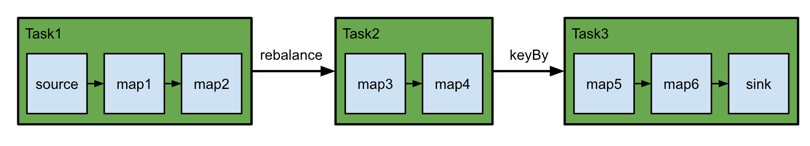

# Execution Mode (Batch/Streaming)

### STREAMING vs BATCH

- DataStream API는 잡 특성과 요구사항에 따라 **런타임 실행 모드**를 선택할 수 있다.
- **STREAMING 모드(클래식/기본)** : **무한(unbounded)** 입력을 대상으로 **연속적·증분 처리**를 수행하며, 잡이 장기간 온라인으로 유지되는 경우에 적합하다.
- **BATCH 모드**: MapReduce 같은 배치 프레임워크와 유사한 방식으로 실행하며, **유한(bounded)** 입력(고정된 입력, 비지속 실행)에 적합하다.
- bounded 입력에 대해선 Flink의 통합 모델 덕분에 **실행 모드와 무관하게 “최종(final) 결과”는 동일**하다.
    - STREAMING은 처리 중 **증분 업데이트(업서트 같은)** 를 계속 낼 수 있고
    - BATCH는 **끝에 한 번 최종 결과**를 내는 경향이 있어 “중간 과정”이 다를 수 있다.

### BATCH 모드의 최적화 이점

- 입력이 bounded임을 알고 있을 때만 가능한 추가 최적화를 적용할 수 있다.
- 예: 더 다양한 조인/집계 전략 선택, 다른 셔플 구현을 통한 **스케줄링 효율** 및 **장애 복구 동작** 개선.

## 언제 BATCH를 써야 하나?

### boundedness 기준

- **BATCH 모드는 bounded 잡에서만 사용 가능**하다.
    - 소스 입력이 실행 전에 모두 확정되면 bounded, 새 데이터가 계속 올 수 있으면 unbounded
    - 잡은 모든 소스가 bounded면 bounded, 하나라도 unbounded면 unbounded
- **STREAMING 모드는 bounded/unbounded 모두** 실행 가능하다.

### 경험칙과 예외

- 경험칙:
    - bounded면 **BATCH 권장(대체로 더 효율적)**
    - unbounded면 **STREAMING 필수**
- 예외적으로 bounded를 STREAMING으로 돌리는 경우:
    - bounded 잡으로 상태를 부트스트랩 → savepoint 생성 → unbounded 잡에 복원(특수 운영 패턴)
    - unbounded 소스에서 돌릴 코드를 테스트할 때 bounded 소스를 쓰는 편이 자연스러운 경우

## 실행 모드 설정

### execution.runtime-mode

- 설정 키: `execution.runtime-mode`
- 값:
    - `STREAMING`(기본)
    - `BATCH`
    - `AUTOMATIC`(소스 boundedness 기반으로 시스템이 결정)
- 설정 방법:
    - 제출 시 커맨드라인 옵션(`bin/flink run -Dexecution.runtime-mode=BATCH ...`)
    - 또는 코드에서 `env.setRuntimeMode(RuntimeExecutionMode.BATCH)`
- 권장: **코드에 고정하지 말고 제출 시 커맨드라인에서 설정**(동일 애플리케이션을 상황에 따라 모드만 바꿔 실행 가능).

## Execution Behavior

### 태스크 스케줄링 & 네트워크 셔플 개요

- Flink 잡은 데이터플로우 그래프의 여러 연산으로 구성되며, 시스템이
    - 연산을 어떤 TaskManager/프로세스에 배치할지(스케줄링)
    - 연산 간 데이터를 어떻게 재분배할지(셔플)
      를 결정한다.
- `map/flatMap/filter` 같은 1:1 연결 연산은 보통 **체이닝**되어 셔플 없이 다음 연산으로 전달된다.
- `rebalance/keyBy`는 병렬 인스턴스 간 재분배가 필요해 **셔플을 유발**한다.
- BATCH는 입력이 bounded라 더 효율적인 구조/알고리즘을 적용할 여지가 있어 스케줄링·셔플 동작이 STREAMING과 달라진다.

### STREAMING 모드 동작

- 모든 태스크가 **항상 온라인**으로 실행되어야 하며, 새 레코드를 파이프라인 전체에서 즉시 처리해 **연속·저지연**을 달성한다.
- 셔플은 **pipelined**로 동작해 레코드가 네트워크 버퍼링 후 곧바로 downstream으로 전달된다.
- 연속 스트림에서는 태스크 사이에 중간 결과를 “물리화”할 자연스러운 지점이 없다는 점이 BATCH와 대비된다.

### BATCH 모드 동작(스테이징 & 중간 결과 물리화)

- 잡의 태스크를 셔플 경계 기준으로 **stage로 분리**하고 **순차 실행**할 수 있다(입력이 bounded이기 때문).
- 레코드를 즉시 downstream으로 보내지 않고, stage 사이 중간 결과를 **비휘발성 저장소에 물리화(materialize)** 해 두었다가 다음 stage가 읽는다.
- 효과:
    - 지연(latency)은 증가할 수 있으나
    - 장애 시 전체 재시작 대신 **남아 있는 중간 결과로 backtrack**해 일부만 재시작 가능
    - 태스크를 순차 실행하므로 **동시에 필요한 슬롯/자원이 더 적을 수 있음**
- 중간 결과는 downstream 소비가 끝날 때까지 유지되며, 공간이 허용하면 장애 대비 backtracking을 위해 추가로 보관될 수 있다.

## State Backends / State

### STREAMING vs BATCH의 상태 처리

- STREAMING 모드:
    - **StateBackend**로 상태 저장 방식과 체크포인팅 동작을 제어한다.
- BATCH 모드:
    - 설정된 state backend를 **무시**한다.
    - keyed 연산 입력을 **키 기준으로 정렬/그룹핑**해 키별로 순차 처리하며,
    - 동시에 **한 키의 상태만** 유지하고, 다음 키로 넘어가면 이전 키 상태는 폐기한다.

## Order of Processing

### 레코드 처리 순서 차이

- STREAMING:
    - UDF는 입력 레코드 **순서에 대한 가정 금지**(도착 즉시 처리).
- BATCH:
    - 일부 연산에서 Flink가 **순서를 보장**할 수 있다(스케줄링/셔플/키별 처리 방식의 결과 또는 시스템의 의도적 선택).
- 입력 타입 3가지:
    - broadcast / regular(비키드) / keyed
- 다중 입력 소비 함수의 처리 우선순위:
    - **broadcast → regular → keyed**
- 여러 regular/broadcast 입력(CoProcessFunction 등)은 해당 타입 내에서 **임의 순서**로 처리될 수 있다.
- 여러 keyed 입력(KeyedCoProcessFunction 등)은 **한 키에 대해 모든 keyed 입력의 레코드를 처리한 뒤** 다음 키로 이동한다.

## Event Time / Watermarks

### STREAMING의 워터마크 vs BATCH의 “완벽 워터마크”

- STREAMING:
    - out-of-order 가능성을 가정하므로 **Watermark** 휴리스틱을 사용한다.
    - 워터마크 T는 “t < T 이벤트는 더 오지 않는다”는 신호.
- BATCH:
    - 입력이 사전에 알려져 있어 타임스탬프 정렬 가능 → “완벽한 워터마크”에 가깝다.
    - keyed면 키별 입력 끝, non-keyed면 전체 입력 끝에 **MAX_WATERMARK**만 있으면 충분한 형태가 된다.
    - 사용자 정의 WatermarkAssigner/Generator는 무시되고, 타이머는 입력 끝에 발화한다.
