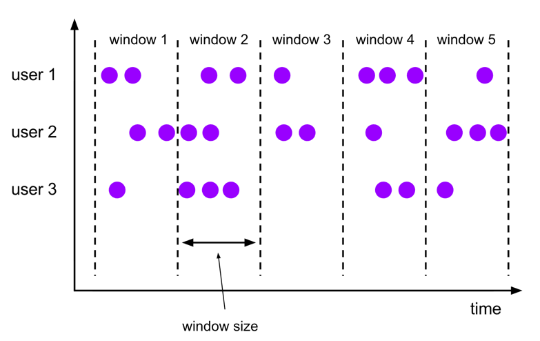
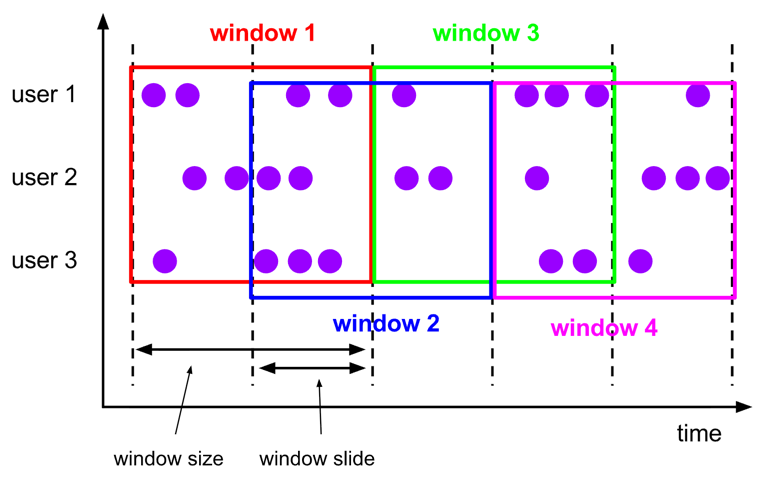
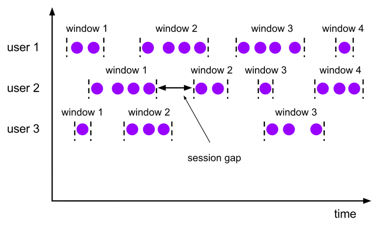
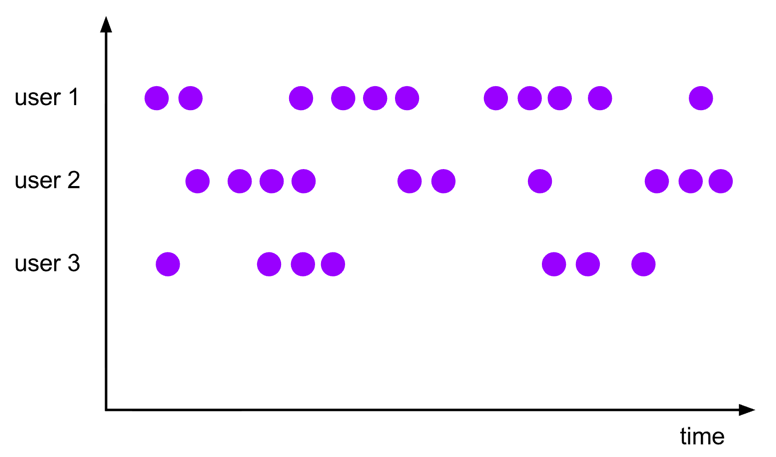
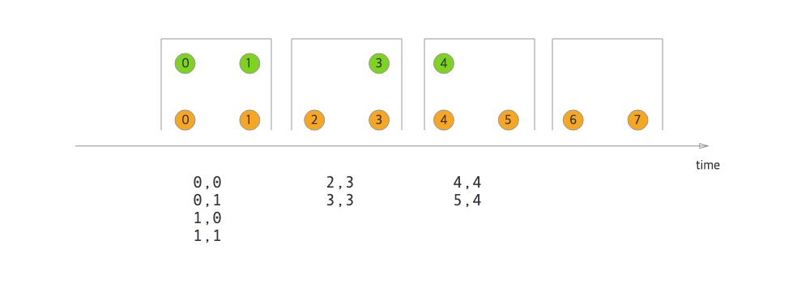
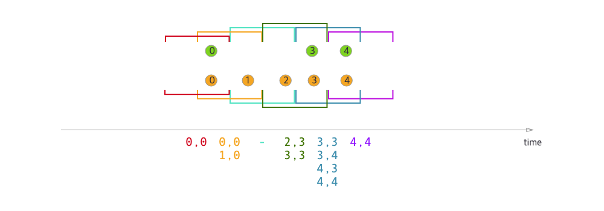
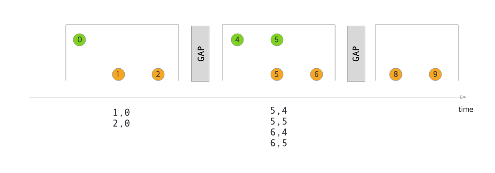
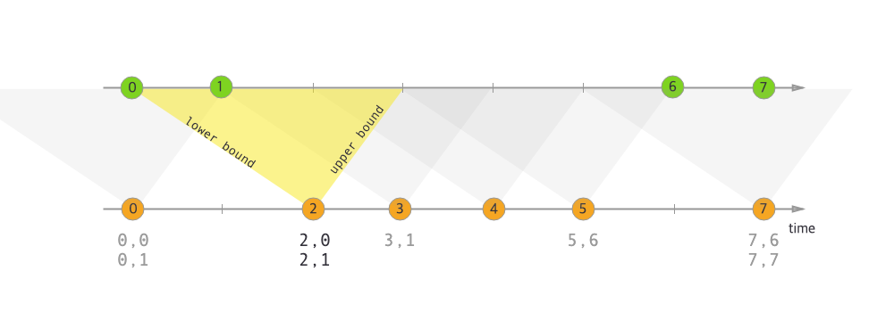
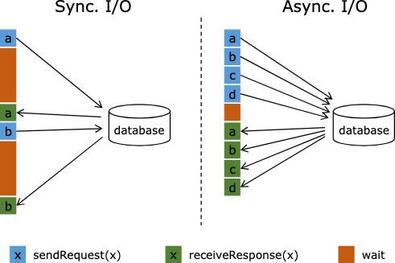

# Operators

### Operator 역할

- Operator는 하나 이상의 **DataStream**을 변환해 새로운 **DataStream**을 만든다
- 여러 변환을 조합해 복잡한 데이터플로우 토폴로지를 구성할 수 있다
- 이 섹션은 기본 변환들, 변환 후의 물리적 파티셔닝, 그리고 **operator chaining**(연쇄 실행)에 대한 개념을 다룬다

## DataStream Transformations

### Map (DataStream → DataStream)

- 입력 1개 요소를 받아 **출력 1개 요소**를 생성하는 1:1 변환
- 예: 값 2배로 변환

```java
DataStream<Integer> dataStream = //...
        dataStream.map(new MapFunction<Integer, Integer>() {
            @Override
            public Integer map(Integer value) throws Exception {
                return 2 * value;
            }
        });

```

### FlatMap (DataStream → DataStream)

- 입력 1개 요소를 받아 **0개/1개/여러 개 요소**를 출력
- 예: 문장을 단어로 분해해 여러 레코드로 방출

```
dataStream.flatMap(new FlatMapFunction<String, String>() {
    @Override
    public void flatMap(String value, Collector<String> out)
        throws Exception {
        for(String word: value.split(" ")){
            out.collect(word);
        }
    }
});
```

### Filter (DataStream → DataStream)

- 각 요소에 대해 boolean 조건을 평가해 **true만 유지**
- 예: 0 값 제거

```
dataStream.filter(new FilterFunction<Integer>() {
  @Override
  public boolean filter(Integer value) throws Exception {
    return value != 0;
  }
});

```

### KeyBy (DataStream → KeyedStream)

- 스트림을 **키 기준으로 논리적 파티셔닝**(동일 키는 동일 파티션으로)
- 내부적으로는 **해시 파티셔닝** 기반
- 키로 사용할 수 없는 타입 예:
    - POJO인데 `hashCode()`를 오버라이드하지 않고 `Object.hashCode()`에 의존하는 경우
    - 모든 타입의 배열(array)

````
dataStream.keyBy(value -> value.getSomeKey());
dataStream.keyBy(value -> value.f0);
````

### Reduce (KeyedStream → DataStream)

- 키별로 **롤링(누적) reduce** 수행
- 새 요소와 “이전까지의 reduce 결과”를 결합해 계속 갱신된 값을 방출
- 예: 부분합 스트림 생성

```
keyedStream.reduce(new ReduceFunction<Integer>() {
    @Override
    public Integer reduce(Integer value1, Integer value2)
    throws Exception {
        return value1 + value2;
    }
});
```

### Window (KeyedStream → WindowedStream)

- **KeyedStream에 대해** 키별로 윈도우를 정의해 그룹화
- 예: 최근 5초 동안 도착한 데이터 묶기

```
dataStream
  .keyBy(value -> value.f0)
  .window(TumblingEventTimeWindows.of(Duration.ofSeconds(5)));
```

### WindowAll (DataStream → AllWindowedStream)

- **일반 DataStream 전체**를 대상으로 윈도우 그룹화
- 많은 경우 **비병렬 변환**이 될 수 있음: 모든 레코드를 한 태스크로 모아 처리

````
dataStream
  .windowAll(TumblingEventTimeWindows.of(Duration.ofSeconds(5)));
````

### Window Apply (WindowedStream/AllWindowedStream → DataStream)

- 윈도우 “전체”에 일반 함수를 적용
- `windowAll`을 쓴 경우에는 `AllWindowFunction`을 사용해야 함

````
windowedStream.apply(new WindowFunction<Tuple2<String,Integer>, Integer, Tuple, Window>() {
    public void apply (Tuple tuple,
            Window window,
            Iterable<Tuple2<String, Integer>> values,
            Collector<Integer> out) throws Exception {
        int sum = 0;
        for (value t: values) {
            sum += t.f1;
        }
        out.collect (new Integer(sum));
    }
});

// applying an AllWindowFunction on non-keyed window stream
allWindowedStream.apply (new AllWindowFunction<Tuple2<String,Integer>, Integer, Window>() {
    public void apply (Window window,
            Iterable<Tuple2<String, Integer>> values,
            Collector<Integer> out) throws Exception {
        int sum = 0;
        for (value t: values) {
            sum += t.f1;
        }
        out.collect (new Integer(sum));
    }
});
````

### WindowReduce (WindowedStream → DataStream)

- 윈도우 내부 요소에 대해 reduce를 적용해 **하나의 축약 결과**를 반환

````
windowedStream.reduce (new ReduceFunction<Tuple2<String,Integer>>() {
    public Tuple2<String, Integer> reduce(Tuple2<String, Integer> value1, Tuple2<String, Integer> value2) throws Exception {
        return new Tuple2<String,Integer>(value1.f0, value1.f1 + value2.f1);
    }
});
````

### Union (DataStream* → DataStream)

- 둘 이상의 스트림을 합쳐 하나의 스트림으로 만든다
- 동일 스트림을 자기 자신과 union하면 결과에 **중복으로 들어간다**

````
dataStream.union(otherStream1, otherStream2, ...);
````

### Window Join (DataStream + DataStream → DataStream)

- 두 스트림을 **키 + 공통 윈도우** 기준으로 조인

````
dataStream.join(otherStream)
    .where(<key selector>).equalTo(<key selector>)
    .window(TumblingEventTimeWindows.of(Duration.ofSeconds(3)))
    .apply (new JoinFunction () {...});
````

### Interval Join (KeyedStream + KeyedStream → DataStream)

- 동일 키를 가진 두 요소 e1/e2를 **시간 구간 조건**으로 조인
- 조건: `e1.ts + lowerBound <= e2.ts <= e1.ts + upperBound` (경계 포함/제외 옵션 가능)

````
// this will join the two streams so that
// key1 == key2 && leftTs - 2 < rightTs < leftTs + 2
keyedStream.intervalJoin(otherKeyedStream)
    .between(Duration.ofMillis(-2), Duration.ofMillis(2)) // lower and upper bound
    .upperBoundExclusive(true) // optional
    .lowerBoundExclusive(true) // optional
    .process(new IntervalJoinFunction() {...});

````

### Window CoGroup (DataStream + DataStream → DataStream)

- 두 스트림을 **키 + 공통 윈도우** 기준으로 coGroup 후 apply로 처리

````
dataStream.coGroup(otherStream)
    .where(0).equalTo(1)
    .window(TumblingEventTimeWindows.of(Duration.ofSeconds(3)))
    .apply (new CoGroupFunction () {...});
````

### Connect (DataStream + DataStream → ConnectedStream)

- 두 스트림을 “연결”하되 **각 스트림의 타입을 유지**
- 두 스트림 사이에 **공유 상태(shared state)** 를 활용하는 패턴에 사용

````
dataStream.coGroup(otherStream)
    .where(0).equalTo(1)
    .window(TumblingEventTimeWindows.of(Duration.ofSeconds(3)))
    .apply (new CoGroupFunction () {...});
````

### CoMap / CoFlatMap (ConnectedStream → DataStream)

- ConnectedStream에 대해 map/flatMap과 유사하게 각각의 입력(1/2)에 대한 로직을 분리해 적용

```
connectedStreams.map(new CoMapFunction<Integer, String, Boolean>() {
    @Override
    public Boolean map1(Integer value) {
        return true;
    }

    @Override
    public Boolean map2(String value) {
        return false;
    }
});
connectedStreams.flatMap(new CoFlatMapFunction<Integer, String, String>() {

   @Override
   public void flatMap1(Integer value, Collector<String> out) {
       out.collect(value.toString());
   }

   @Override
   public void flatMap2(String value, Collector<String> out) {
       for (String word: value.split(" ")) {
         out.collect(word);
       }
   }
});
````

### Cache (DataStream → CachedDataStream)

- 변환의 **중간 결과를 캐시**해 이후 잡에서 재사용
- 현재는 **배치 실행 모드**에서만 지원
- 캐시는 최초 계산 시 **지연(lazy) 생성**되며, 캐시가 유실되면 원 변환으로 재계산

````
DataStream<Integer> dataStream = //...
CachedDataStream<Integer> cachedDataStream = dataStream.cache();
cachedDataStream.print(); // Do anything with the cachedDataStream
...
env.execute(); // Execute and create cache.
        
cachedDataStream.print(); // Consume cached result.
env.execute();

````

### Full Window Partition (DataStream → PartitionWindowedStream)

- 각 파티션(또는 키)의 모든 레코드를 “전체 윈도우”로 모아 처리
- 입력 종료 시점에 방출되며 주로 **배치 처리**에 적합
- non-keyed: 파티션=서브태스크의 레코드 전체 / keyed: 파티션=키의 레코드 전체

````java
DataStream<Integer> dataStream = //...
        PartitionWindowedStream < Integer > partitionWindowedDataStream = dataStream.fullWindowPartition();
// do full window partition processing with PartitionWindowedStream
DataStream<Integer> resultStream = partitionWindowedDataStream.mapPartition(
        new MapPartitionFunction<Integer, Integer>() {
            @Override
            public void mapPartition(
                    Iterable<Integer> values, Collector<Integer> out) {
                int result = 0;
                for (Integer value : values) {
                    result += value;
                }
                out.collect(result);
            }
        }
);
````

## Physical Partitioning (저수준 파티셔닝 제어)

### Custom Partitioning (DataStream → DataStream)

- 사용자 정의 **Partitioner**로 각 요소의 대상 태스크를 직접 선택

````
dataStream.partitionCustom(partitioner, "someKey");
dataStream.partitionCustom(partitioner, 0);
````

### Random Partitioning / Shuffle (DataStream → DataStream)

- 균등 분포를 목표로 요소를 **랜덤 분산**

````
dataStream.shuffle();
````

### Rescale (DataStream → DataStream)

- 다운스트림의 “일부 서브태스크 집합”으로 **라운드로빈 분산**
- `rebalance()`보다 전면 재분산 비용이 낮을 수 있고(상황에 따라 로컬 전송 위주), 병렬도 비율에 따라 연결 패턴이 달라짐
- 업/다운 병렬도가 배수가 아니면 일부 다운스트림은 입력 개수가 달라질 수 있음


```
dataStream.rescale();
```

### Broadcast (DataStream → DataStream)

- 모든 요소를 **모든 파티션(서브태스크)** 에 브로드캐스트

````
dataStream.broadcast();
````

## Task Chaining & Resource Groups

````
someStream.filter(...).map(...).startNewChain().map(...);
````

### Operator Chaining

- 연속된 변환을 같은 스레드/태스크에 **체인으로 묶어 성능을 향상**
- Flink는 가능하면 기본적으로 체이닝을 수행(예: 연속 map)
- 전체 잡에서 체이닝을 끄려면 `disableOperatorChaining()` 사용
- 변환 직후에만 체이닝 제어 API를 호출할 수 있음(“바로 이전 operator”에 적용되는 형태)

````
someStream.map(...).disableChaining();
````

### Slot Sharing Group (리소스 그룹)

- Resource group은 Flink의 **slot** 개념과 연결되며, 같은 slot sharing group은 같은 슬롯에 배치
- 기본 그룹 이름은 `"default"`
- 일부 operator를 별도 슬롯에 격리하고 싶을 때 활용

````
someStream.filter(...).slotSharingGroup("name");

````

### 체이닝 제어 예시 의미

- `startNewChain()`: 해당 operator부터 새 체인을 시작(앞 체인과 분리)
- `disableChaining()`: 해당 operator는 체이닝하지 않음
- `slotSharingGroup(name)`: 슬롯 공유 그룹 지정

## Name & Description

````
someStream.filter(...).name("filter").setDescription("x in (1, 2, 3, 4) and y > 1");
````

### name

- Web UI, 스레드 이름, 로그, 메트릭 등에 사용
- job vertex 이름도 operator name을 기반으로 구성되므로 **짧고 간결**하게 유지하는 것이 권장됨(외부 시스템 부담 감소)

### description

- 실행 계획(execution plan) 및 Web UI의 vertex 상세에 사용
- 디버깅을 위해 operator의 동작을 더 자세히 적어도 됨
- 기본적으로 job vertex description은 트리 형태 문자열이며, `pipeline.vertex-description-mode`로 표현 형식을 조정 가능

### 복잡한 토폴로지에서의 식별성 개선

- `pipeline.vertex-name-include-index-prefix`를 켜면 vertex 이름에 토폴로지 인덱스를 포함해 로그/메트릭에서 추적이 쉬워진다
- Flink SQL이 생성한 operator는 기본적으로 “타입+id” 형태의 이름과 상세 description을 가지며, 설정으로 과거 방식처럼 이름을 더 자세히 만들 수도 있다

# Windows

### 무한 스트림 처리의 핵심

- Window는 무한 스트림을 **유한한 “버킷”** 으로 나눠 그 위에서 계산을 수행하게 해준다
- Flink 윈도우 프로그램 구조(필수/선택 요소)
    - Keyed: `keyBy(...).window(assigner)...reduce/aggregate/apply()`
    - Non-keyed: `windowAll(assigner)...reduce/aggregate/apply()`
- 선택 옵션: `trigger`, `evictor`, `allowedLateness`, `sideOutputLateData`, `getSideOutput`
- 참고: Python DataStream API는 **Evictor 미지원**

## Window Lifecycle

### 생성과 제거

- 윈도우는 **해당 윈도우에 속할 첫 요소가 도착할 때 생성**
- 시간 기반 윈도우는 **윈도우 끝 시각 + allowed lateness**를 watermark(또는 처리시간)가 지난 뒤 완전히 제거됨
- Flink가 “제거”를 보장하는 것은 **시간 기반 윈도우**이며, GlobalWindow 같은 일부 타입은 동일한 보장이 없음
- Trigger는 “언제 계산할지”를 결정하며, 필요 시 윈도우의 **내용(elements)** 만 purge할 수 있음(메타데이터는 유지 → 이후 데이터 추가 가능)

## Keyed vs Non-Keyed Windows

````
// Keyed window
stream
       .keyBy(...)               <-  keyed versus non-keyed windows
       .window(...)              <-  required: "assigner"
      [.trigger(...)]            <-  optional: "trigger" (else default trigger)
      [.evictor(...)]            <-  optional: "evictor" (else no evictor)
      [.allowedLateness(...)]    <-  optional: "lateness" (else zero)
      [.sideOutputLateData(...)] <-  optional: "output tag" (else no side output for late data)
       .reduce/aggregate/apply()      <-  required: "function"
      [.getSideOutput(...)]      <-  optional: "output tag"

// Non-keyed window
stream
       .windowAll(...)           <-  required: "assigner"
      [.trigger(...)]            <-  optional: "trigger" (else default trigger)
      [.evictor(...)]            <-  optional: "evictor" (else no evictor)
      [.allowedLateness(...)]    <-  optional: "lateness" (else zero)
      [.sideOutputLateData(...)] <-  optional: "output tag" (else no side output for late data)
       .reduce/aggregate/apply()      <-  required: "function"
      [.getSideOutput(...)]      <-  optional: "output tag"
````

### 병렬성 차이

- `keyBy(...)`를 하면 스트림이 키별 논리 스트림으로 분리되어 **키 단위로 병렬 처리 가능**
    - 동일 키 레코드는 동일 병렬 태스크로 전달
- Non-keyed(키 없음)는 전체가 분리되지 않아 보통 **parallelism=1**로 처리됨

## Window Assigners

### 요소를 어떤 윈도우에 넣을지 결정

- `window(...)` / `windowAll(...)`에 지정하는 `WindowAssigner`가 요소를 **하나 이상 윈도우에 배정**
- 기본 제공: **Tumbling / Sliding / Session / Global**
- Global 제외 대부분은 **시간 기반**(Processing Time 또는 Event Time)
- 시간 기반 윈도우는 `[start, end)`(start 포함, end 제외) 범위를 가지며, `maxTimestamp()`는 윈도우에서 허용 가능한 최대 타임스탬프(보통 `end-1`)를 의미

## Tumbling Windows



### 고정 크기, 비겹침

- 고정 길이의 윈도우로 나누며 **서로 겹치지 않음**
- 옵션: offset으로 윈도우 정렬(에폭 기준 정렬)을 이동 가능
    - 예: 타임존 보정 목적(UTC 기준이 아닌 정렬) 등

```
DataStream<T> input = ...;

// tumbling event-time windows
input
    .keyBy(<key selector>)
    .window(TumblingEventTimeWindows.of(Duration.ofSeconds(5)))
    .<windowed transformation>(<window function>);

// tumbling processing-time windows
input
    .keyBy(<key selector>)
    .window(TumblingProcessingTimeWindows.of(Duration.ofSeconds(5)))
    .<windowed transformation>(<window function>);

// daily tumbling event-time windows offset by -8 hours.
input
    .keyBy(<key selector>)
    .window(TumblingEventTimeWindows.of(Duration.ofDays(1), Duration.ofHours(-8)))
    .<windowed transformation>(<window function>);
```

## Sliding Windows



### 고정 크기 + 슬라이드, 겹칠 수 있음

- 윈도우 크기(window size)와 시작 간격(slide)로 정의
- `slide < size`면 윈도우가 겹치며 요소는 **여러 윈도우에 복제**되어 들어갈 수 있음
- Tumbling과 마찬가지로 offset 지원(정렬 조정/타임존 보정 등)

````
DataStream<T> input = ...;

// sliding event-time windows
input
    .keyBy(<key selector>)
    .window(SlidingEventTimeWindows.of(Duration.ofSeconds(10), Duration.ofSeconds(5)))
    .<windowed transformation>(<window function>);

// sliding processing-time windows
input
    .keyBy(<key selector>)
    .window(SlidingProcessingTimeWindows.of(Duration.ofSeconds(10), Duration.ofSeconds(5)))
    .<windowed transformation>(<window function>);

// sliding processing-time windows offset by -8 hours
input
    .keyBy(<key selector>)
    .window(SlidingProcessingTimeWindows.of(Duration.ofHours(12), Duration.ofHours(1), Duration.ofHours(-8)))
    .<windowed transformation>(<window function>);

````

## Session Windows



### 활동 세션 기반, 가변 길이

- 고정 start/end가 없고, **비활동 gap**이 일정 시간 이상이면 세션 종료
- gap은 고정값 또는 요소별 동적 추출 함수로 설정 가능
- 내부적으로는 레코드마다 윈도우를 만들고, gap보다 가까우면 **윈도우를 merge**
    - 그래서 **merging trigger**와 **merging 가능한 window function**(Reduce/Aggregate/Process)이 필요

````
DataStream<T> input = ...;

// event-time session windows with static gap
input
    .keyBy(<key selector>)
    .window(EventTimeSessionWindows.withGap(Duration.ofMinutes(10)))
    .<windowed transformation>(<window function>);
    
// event-time session windows with dynamic gap
input
    .keyBy(<key selector>)
    .window(EventTimeSessionWindows.withDynamicGap((element) -> {
        // determine and return session gap
    }))
    .<windowed transformation>(<window function>);

// processing-time session windows with static gap
input
    .keyBy(<key selector>)
    .window(ProcessingTimeSessionWindows.withGap(Duration.ofMinutes(10)))
    .<windowed transformation>(<window function>);
    
// processing-time session windows with dynamic gap
input
    .keyBy(<key selector>)
    .window(ProcessingTimeSessionWindows.withDynamicGap((element) -> {
        // determine and return session gap
    }))
    .<windowed transformation>(<window function>);

````

## Global Windows



### 키별 단일 윈도우

- 동일 키의 모든 요소가 **하나의 전역 윈도우**로 모임
- 자연스러운 “끝”이 없으므로 **커스텀 trigger 없으면 계산이 일어나지 않음**
    - 기본 트리거가 NeverTrigger(발화 안 함)

````
DataStream<T> input = ...;

input
    .keyBy(<key selector>)
    .window(GlobalWindows.create())
    .<windowed transformation>(<window function>);

````

## Window Functions

### 윈도우가 “준비됨”을 트리거가 판단한 뒤 실행

- 종류: `ReduceFunction`, `AggregateFunction`, `ProcessWindowFunction`
- `Reduce/Aggregate`는 요소 도착 시점에 **증분 집계** 가능 → 상태/성능 효율적
- `ProcessWindowFunction`은 윈도우의 모든 요소 `Iterable`과 컨텍스트(시간/상태/사이드아웃풋)를 받아 유연하지만
    - 내부 버퍼링이 필요해 비용이 큼
- 실무 패턴: `Reduce/Aggregate + ProcessWindowFunction`을 조합해
    - 증분 집계 효율 + 윈도우 메타데이터 접근을 동시에 얻음

````
// ReduceFunction example
DataStream<Tuple2<String, Long>> input = ...;

input
    .keyBy(<key selector>)
    .window(<window assigner>)
    .reduce(new ReduceFunction<Tuple2<String, Long>>() {
      public Tuple2<String, Long> reduce(Tuple2<String, Long> v1, Tuple2<String, Long> v2) {
        return new Tuple2<>(v1.f0, v1.f1 + v2.f1);
      }
    });
````

````
// AggregateFunction example
DataStream<Tuple2<String, Long>> input = ...;

input
    .keyBy(<key selector>)
    .window(<window assigner>)
    .aggregate(new AverageAggregate());

````

````java
/**
 * The accumulator is used to keep a running sum and a count. The {@code getResult} method
 * computes the average.
 */
private static class AverageAggregate
        implements AggregateFunction<Tuple2<String, Long>, Tuple2<Long, Long>, Double> {
    @Override
    public Tuple2<Long, Long> createAccumulator() {
        return new Tuple2<>(0L, 0L);
    }

    @Override
    public Tuple2<Long, Long> add(Tuple2<String, Long> value, Tuple2<Long, Long> accumulator) {
        return new Tuple2<>(accumulator.f0 + value.f1, accumulator.f1 + 1L);
    }

    @Override
    public Double getResult(Tuple2<Long, Long> accumulator) {
        return ((double) accumulator.f0) / accumulator.f1;
    }

    @Override
    public Tuple2<Long, Long> merge(Tuple2<Long, Long> a, Tuple2<Long, Long> b) {
        return new Tuple2<>(a.f0 + b.f0, a.f1 + b.f1);
    }
}

````

```java
public abstract class ProcessWindowFunction<IN, OUT, KEY, W extends Window> implements Function {

    /**
     * Evaluates the window and outputs none or several elements.
     *
     * @param key The key for which this window is evaluated.
     * @param context The context in which the window is being evaluated.
     * @param elements The elements in the window being evaluated.
     * @param out A collector for emitting elements.
     *
     * @throws Exception The function may throw exceptions to fail the program and trigger recovery.
     */
    public abstract void process(
            KEY key,
            Context context,
            Iterable<IN> elements,
            Collector<OUT> out) throws Exception;

    /**
     * Deletes any state in the {@code Context} when the Window expires (the watermark passes its
     * {@code maxTimestamp} + {@code allowedLateness}).
     *
     * @param context The context to which the window is being evaluated
     * @throws Exception The function may throw exceptions to fail the program and trigger recovery.
     */
    public void clear(Context context) throws Exception {
    }

    /**
     * The context holding window metadata.
     */
    public abstract class Context implements java.io.Serializable {
        /**
         * Returns the window that is being evaluated.
         */
        public abstract W window();

        /** Returns the current processing time. */
        public abstract long currentProcessingTime();

        /** Returns the current event-time watermark. */
        public abstract long currentWatermark();

        /**
         * State accessor for per-key and per-window state.
         *
         * <p><b>NOTE:</b>If you use per-window state you have to ensure that you clean it up
         * by implementing {@link ProcessWindowFunction#clear(Context)}.
         */
        public abstract KeyedStateStore windowState();

        /**
         * State accessor for per-key global state.
         */
        public abstract KeyedStateStore globalState();

        /**
         * Emits a record to the side output identified by the {@code OutputTag}.
         *
         * @param outputTag the {@code OutputTag} that identifies the side output to emit to.
         * @param value The record to emit.
         */
        public abstract <X> void output(OutputTag<X> outputTag, X value);
    }

}

```

````
// ProcessWindowFunction example
DataStream<Tuple2<String, Long>> input = ...;

input
  .keyBy(t -> t.f0)
  .window(TumblingEventTimeWindows.of(Duration.ofMinutes(5)))
  .process(new MyProcessWindowFunction());

/* ... */

````

```java
public class MyProcessWindowFunction
        extends ProcessWindowFunction<Tuple2<String, Long>, String, String, TimeWindow> {

    @Override
    public void process(String key, Context context, Iterable<Tuple2<String, Long>> input, Collector<String> out) {
        long count = 0;
        for (Tuple2<String, Long> in : input) {
            count++;
        }
        out.collect("Window: " + context.window() + "count: " + count);
    }
}

````

````
// Incremental Window Aggregation with ReduceFunction 
DataStream<SensorReading> input = ...;

input
  .keyBy(<key selector>)
  .window(<window assigner>)
  .reduce(new MyReduceFunction(), new MyProcessWindowFunction());

````

````java
// Function definitions

private static class MyReduceFunction implements ReduceFunction<SensorReading> {

    public SensorReading reduce(SensorReading r1, SensorReading r2) {
        return r1.value() > r2.value() ? r2 : r1;
    }
}

private static class MyProcessWindowFunction
        extends ProcessWindowFunction<SensorReading, Tuple2<Long, SensorReading>, String, TimeWindow> {

    public void process(String key,
                        Context context,
                        Iterable<SensorReading> minReadings,
                        Collector<Tuple2<Long, SensorReading>> out) {
        SensorReading min = minReadings.iterator().next();
        out.collect(new Tuple2<Long, SensorReading>(context.window().getStart(), min));
    }
}

````

````
// Incremental Window Aggregation with AggregateFunction #
DataStream<Tuple2<String, Long>> input = ...;

input
  .keyBy(<key selector>)
  .window(<window assigner>)
  .aggregate(new AverageAggregate(), new MyProcessWindowFunction());

// Function definitions
````

````java
/**
 * The accumulator is used to keep a running sum and a count. The {@code getResult} method
 * computes the average.
 */
private static class AverageAggregate
        implements AggregateFunction<Tuple2<String, Long>, Tuple2<Long, Long>, Double> {
    @Override
    public Tuple2<Long, Long> createAccumulator() {
        return new Tuple2<>(0L, 0L);
    }

    @Override
    public Tuple2<Long, Long> add(Tuple2<String, Long> value, Tuple2<Long, Long> accumulator) {
        return new Tuple2<>(accumulator.f0 + value.f1, accumulator.f1 + 1L);
    }

    @Override
    public Double getResult(Tuple2<Long, Long> accumulator) {
        return ((double) accumulator.f0) / accumulator.f1;
    }

    @Override
    public Tuple2<Long, Long> merge(Tuple2<Long, Long> a, Tuple2<Long, Long> b) {
        return new Tuple2<>(a.f0 + b.f0, a.f1 + b.f1);
    }
}

private static class MyProcessWindowFunction
        extends ProcessWindowFunction<Double, Tuple2<String, Double>, String, TimeWindow> {

    public void process(String key,
                        Context context,
                        Iterable<Double> averages,
                        Collector<Tuple2<String, Double>> out) {
        Double average = averages.iterator().next();
        out.collect(new Tuple2<>(key, average));
    }
}
````

## Triggers

### 언제 윈도우를 계산할지 결정

- 각 assigner에는 기본 Trigger가 있으며, `trigger(...)`로 교체 가능
- Trigger는 요소 도착, 이벤트타임/프로세싱타임 타이머, 윈도우 merge, clear 시점에 반응
- 반환 액션(TriggerResult)
    - `CONTINUE`, `FIRE`, `PURGE`, `FIRE_AND_PURGE`
- FIRE는 결과를 내보내되 내용 유지, FIRE_AND_PURGE는 결과 후 내용 삭제
- 대표 기본/내장 트리거
    - EventTimeTrigger: watermark가 윈도우 끝을 지나면 발화
    - ProcessingTimeTrigger: 처리시간 기반
    - CountTrigger: 개수 기반
    - PurgingTrigger: 다른 트리거를 purge형으로 감쌈
- GlobalWindow는 기본이 NeverTrigger → 반드시 커스텀 트리거 필요

## Evictors

### 트리거 발화 후 요소를 제거(선택)

- `evictor(...)`로 지정하며, 트리거가 FIRE한 뒤 **함수 적용 전/후**에 요소를 제거 가능
- 내장: CountEvictor / DeltaEvictor / TimeEvictor
- 주의
    - Evictor를 쓰면 사전 집계가 어려워져 **상태가 크게 증가**
    - 윈도우 내부 요소 순서는 보장되지 않음 → “앞에서 제거”가 도착 순서를 의미하지 않을 수 있음
    - Python DataStream API는 Evictor 미지원

```java
/**
 * Optionally evicts elements. Called before windowing function.
 *
 * @param elements The elements currently in the pane.
 * @param size The current number of elements in the pane.
 * @param window The {@link Window}
 * @param evictorContext The context for the Evictor
 */
void evictBefore(Iterable<TimestampedValue<T>> elements, int size, W window, EvictorContext evictorContext);

/**
 * Optionally evicts elements. Called after windowing function.
 *
 * @param elements The elements currently in the pane.
 * @param size The current number of elements in the pane.
 * @param window The {@link Window}
 * @param evictorContext The context for the Evictor
 */
void evictAfter(Iterable<TimestampedValue<T>> elements, int size, W window, EvictorContext evictorContext);
```

## Allowed Lateness & Late Data

### 늦게 도착한 이벤트 처리

- 이벤트타임에서 watermark가 윈도우 end를 지난 뒤 도착하는 요소는 기본적으로 drop(allowed lateness=0)
- `allowedLateness(t)`를 주면
    - watermark가 `end`는 지났지만 `end + lateness` 전이면 윈도우에 **여전히 추가**
    - 트리거(특히 EventTimeTrigger)에 따라 **late firing**(재발화)로 결과가 다시 나갈 수 있음

````
DataStream<T> input = ...;

input
    .keyBy(<key selector>)
    .window(<window assigner>)
    .allowedLateness(<time>)
    .<windowed transformation>(<window function>);
````

- `sideOutputLateData(OutputTag)`로 **drop된 late data**를 사이드 출력으로 분리 가능

```
final OutputTag<T> lateOutputTag = new OutputTag<T>("late-data"){};

DataStream<T> input = ...;

SingleOutputStreamOperator<T> result = input
    .keyBy(<key selector>)
    .window(<window assigner>)
    .allowedLateness(<time>)
    .sideOutputLateData(lateOutputTag)
    .<windowed transformation>(<window function>);

DataStream<T> lateStream = result.getSideOutput(lateOutputTag);

```

- late firing 결과는 “업데이트된 결과”로 여러 번 나갈 수 있으므로
    - 애플리케이션에서 중복/업데이트 처리(예: dedup, upsert)를 고려해야 함
- GlobalWindows는 end가 사실상 무한(Long.MAX_VALUE)이라 “late” 개념이 거의 적용되지 않음

## Working with window results

### 결과 스트림의 메타데이터

- 윈도우 연산 결과는 다시 DataStream이며, 기본적으로 윈도우 정보가 결과에 자동 포함되지 않음
    - 윈도우 메타가 필요하면 ProcessWindowFunction에서 **직접 결과에 인코딩**
- 결과 요소의 timestamp는 보통 **윈도우의 maxTimestamp(= end-1)** 로 설정됨

## Watermarks and windows

### 워터마크 도착 시 동작

- watermark는
    - `maxTimestamp < watermark`인 윈도우들을 계산 대상으로 만들어 “밀어내고”
    - downstream으로 그대로 전달됨
- 직관적으로 watermark는 이후 단계에서 해당 시각 이전 데이터를 “늦은 데이터”로 만들 수 있는 기준점 역할

## Consecutive windowed operations

### 연속 윈도우 연산 연결

- 결과 timestamp가 `end-1`로 맞춰지고 watermark 전달 방식이 일관돼서
    - 동일 윈도우 크기로 **연속 윈도우 연산을 연결**해도 같은 시간 버킷으로 정렬되기 쉬움
- 예: 5초 윈도우로 키별 합을 만든 뒤, 같은 5초 윈도우로 전체 TopK를 계산

````
DataStream<Integer> input = ...;

DataStream<Integer> resultsPerKey = input
    .keyBy(<key selector>)
    .window(TumblingEventTimeWindows.of(Duration.ofSeconds(5)))
    .reduce(new Summer());

DataStream<Integer> globalResults = resultsPerKey
    .windowAll(TumblingEventTimeWindows.of(Duration.ofSeconds(5)))
    .process(new TopKWindowFunction());

````

## State size considerations

### 상태 크기 추정 규칙

- 요소는 “속한 윈도우 수”만큼 복제되어 저장됨
    - Tumbling: 보통 1개 윈도우에만 속함
    - Sliding: 여러 윈도우에 속해 복제가 많아질 수 있음(짧은 slide + 긴 size는 위험)
- `Reduce/Aggregate`는 증분 집계로 **윈도우당 1개의 집계 상태**만 유지 가능 → 저장량 크게 절감
- `ProcessWindowFunction` 단독 사용은 요소 전체 버퍼링이 필요해 상태가 커짐
- Evictor 사용은 pre-aggregation을 막아 **상태/비용을 크게 증가**시킬 수 있음

# Joining #

## Window Join

- **공통 키**를 가지며 **같은 윈도우에 속한** 두 스트림의 요소들을 조인
- 윈도우는 `WindowAssigner`로 정의되며, **양쪽 스트림 요소를 함께** 평가한다
- 매칭된 (left, right) 쌍은 `JoinFunction` 또는 `FlatJoinFunction`으로 전달되어 사용자 로직으로 결과를 방출한다

### 기본 사용 형태

````
stream.join(otherStream)
    .where(<KeySelector>)
    .equalTo(<KeySelector>)
    .window(<WindowAssigner>)
    .apply(<JoinFunction>);

````

### 의미론(semantics)

- **Inner join처럼 동작**: 한쪽 스트림에 대응되는 요소가 없으면 결과가 나오지 않음
- 조인 결과 레코드의 timestamp는 해당 윈도우 내에서 가능한 **가장 큰 timestamp(= window end - 1)** 가 됨
    - 예: 윈도우가 `[5,10)`이면 결과 timestamp는 `9`

## Tumbling Window Join



- 같은 키 + 같은 **텀블링 윈도우(고정 크기, 비겹침)** 에 있는 요소들을 **모든 쌍(카티시안)으로 조합**해 조인 함수에 전달
- inner join이므로 특정 윈도우에서 한쪽 스트림 요소가 없으면 **그 윈도우는 출력 0**

````
import org.apache.flink.api.java.functions.KeySelector;
import org.apache.flink.streaming.api.windowing.assigners.TumblingEventTimeWindows;
import java.time.Duration;
 
...

DataStream<Integer> orangeStream = ...;
DataStream<Integer> greenStream = ...;

orangeStream.join(greenStream)
    .where(<KeySelector>)
    .equalTo(<KeySelector>)
    .window(TumblingEventTimeWindows.of(Duration.ofMillis(2)))
    .apply (new JoinFunction<Integer, Integer, String> (){
        @Override
        public String join(Integer first, Integer second) {
            return first + "," + second;
        }
    });
````

### 특징 포인트

- 윈도우 단위로 “전부-대-전부” 조합이 만들어질 수 있어(키/윈도우 내 요소 수에 따라) 결과 수가 커질 수 있음

## Sliding Window Join



- 같은 키 + 같은 **슬라이딩 윈도우(겹칠 수 있음)** 에 있는 요소들을 모든 쌍으로 조합해 조인
- inner join이므로 현재 슬라이딩 윈도우에서 반대편 매칭이 없으면 **해당 윈도우에서는 출력 없음**
- 슬라이딩은 윈도우가 겹치므로 **어떤 요소는 한 윈도우에서는 조인되지만 다른 윈도우에서는 조인되지 않을 수 있음**

````
import org.apache.flink.api.java.functions.KeySelector;
import org.apache.flink.streaming.api.windowing.assigners.SlidingEventTimeWindows;
import java.time.Duration;

...

DataStream<Integer> orangeStream = ...;
DataStream<Integer> greenStream = ...;

orangeStream.join(greenStream)
    .where(<KeySelector>)
    .equalTo(<KeySelector>)
    .window(SlidingEventTimeWindows.of(Duration.ofMillis(2) /* size */, Duration.ofMillis(1) /* slide */))
    .apply (new JoinFunction<Integer, Integer, String> (){
        @Override
        public String join(Integer first, Integer second) {
            return first + "," + second;
        }
    });

````

### 특징 포인트

- 겹치는 윈도우 구조 때문에 동일 요소가 여러 윈도우에서 반복적으로 조인될 수 있음

## Session Window Join



### 동작

- 같은 키에 대해 **세션 기준(비활동 gap)** 으로 묶인 범위 안에서 양쪽 스트림 요소를 쌍으로 조인
- inner join이므로 특정 세션에 한쪽 스트림 요소만 있으면 **출력 0**

````
import org.apache.flink.api.java.functions.KeySelector;
import org.apache.flink.streaming.api.windowing.assigners.EventTimeSessionWindows;
import java.time.Duration;
 
...

DataStream<Integer> orangeStream = ...;
DataStream<Integer> greenStream = ...;

orangeStream.join(greenStream)
    .where(<KeySelector>)
    .equalTo(<KeySelector>)
    .window(EventTimeSessionWindows.withGap(Duration.ofMillis(1)))
    .apply (new JoinFunction<Integer, Integer, String> (){
        @Override
        public String join(Integer first, Integer second) {
            return first + "," + second;
        }
    });

````

### 특징 포인트

- 세션은 고정 길이가 아니라 이벤트 간 간격(gap)에 따라 동적으로 경계가 정해짐

## Interval Join



### 개념(상대 시간 구간 조인)

- 두 스트림 A, B에서 같은 키를 가지면서  
  `b.timestamp ∈ [a.timestamp + lowerBound, a.timestamp + upperBound]`  
  를 만족하는 요소 쌍을 조인
- `lowerBound <= upperBound` 조건 하에 **음수/양수 모두 가능**
- 현재 **inner join만 지원**
- 현재 **event time만 지원**

````
import org.apache.flink.api.java.functions.KeySelector;
import org.apache.flink.streaming.api.functions.co.ProcessJoinFunction;
import java.time.Duration;

...

DataStream<Integer> orangeStream = ...;
DataStream<Integer> greenStream = ...;

orangeStream
    .keyBy(<KeySelector>)
    .intervalJoin(greenStream.keyBy(<KeySelector>))
    .between(Duration.ofMillis(-2), Duration.ofMillis(1))
    .process (new ProcessJoinFunction<Integer, Integer, String>(){

        @Override
        public void processElement(Integer left, Integer right, Context ctx, Collector<String> out) {
            out.collect(left + "," + right);
        }
    });

````

### 결과 timestamp

- `ProcessJoinFunction`으로 전달되는 한 쌍은 두 요소 중 **더 큰 timestamp**가 컨텍스트로 제공됨(접근 가능)

### 경계 포함/제외

- 기본은 **inclusive**
- 필요하면 `.lowerBoundExclusive()`, `.upperBoundExclusive()`로 경계를 제외할 수 있음

# Process Function

## The ProcessFunction

- **ProcessFunction**은 Flink의 low-level stream processing 연산으로, (acyclic) 스트리밍 애플리케이션의 핵심 빌딩 블록에 접근한다.
    - **events**: stream elements(레코드)
    - **state**: fault-tolerant + consistent 상태 (**keyed stream에서만**)
    - **timers**: **event time / processing time** 타이머 (**keyed stream에서만**)
- 개념적으로 **keyed state + timers에 접근 가능한 FlatMapFunction**처럼 동작하며, 입력 스트림(들)에서 레코드가 들어올 때마다 호출되어 처리한다.

### Keyed state (RuntimeContext)

- ProcessFunction은 `RuntimeContext`를 통해 Flink의 **keyed state**를 사용한다(다른 stateful function과 동일한 접근 방식).
- 장애 복구를 위해 state는 checkpoint/savepoint에 포함되어 **일관성(consistent)** 있게 복원될 수 있다.

### Timers (Context, TimerService, onTimer)

- `processElement(...)` 호출마다 `Context`가 제공되며, 아래에 접근 가능하다.
    - 레코드의 **event time timestamp**
    - `TimerService`
- `TimerService`로 미래 시점 callback을 등록할 수 있다.
    - **event-time timer**: 현재 **watermark**가 타이머 timestamp 이상으로 진행되면 `onTimer(...)` 호출
    - **processing-time timer**: wall clock time이 지정 시각에 도달하면 `onTimer(...)` 호출
- `onTimer(...)` 실행 시에도 state는 **타이머를 등록한 key 스코프**로 유지되어, 타이머 로직에서 keyed state를 조작할 수 있다.
- keyed state/timer 접근을 하려면 **반드시 keyed stream**에 적용해야 한다.

```
stream.keyBy(...).process(new MyProcessFunction());
```

## Low-level Joins

### CoProcessFunction / KeyedCoProcessFunction

- 두 입력 스트림을 대상으로 low-level 연산(예: 커스텀 join)을 하려면 `CoProcessFunction` 또는 `KeyedCoProcessFunction`을 사용한다.
- 두 입력에 대해 각각 `processElement1(...)`, `processElement2(...)`가 호출되어, 입력별 처리 로직을 분리할 수 있다.

### 구현 패턴

- 일반적인 low-level join 구현 흐름:
    - 한쪽 입력(또는 양쪽)에 대한 **state 객체 생성**
    - 해당 입력 레코드 수신 시 **state 업데이트**
    - 다른 입력 레코드 수신 시 **state를 probe**하여 join 결과 생성
- out-of-order 이벤트에서도 **complete + deterministic join**을 원한다면, timer를 활용해 “충분한 데이터가 도착했다고 볼 수 있는 시점”(예: 특정 stream의
  watermark가 어떤 이벤트 시각을 지남)에 평가/emit하도록 설계할 수 있다.
    - 예: customer data를 state에 유지하고 financial trades와 join할 때, customer stream watermark가 trade 시각을 지난 후 trade join을
      확정적으로 emit.

## Example

### KeyedProcessFunction으로 key별 count + timeout emit

- 예시는 `KeyedProcessFunction`이 **key별 count**를 유지하며,
    - 특정 key에 대해 **1분(event time) 동안 업데이트가 없으면** `(key, count)`를 emit한다.
- 핵심 아이디어:
    - `ValueState`에 `count`, `key`, `lastModified`(마지막 갱신 timestamp)를 저장 (key 기준으로 암묵적으로 스코프)
    - 매 레코드마다 count 증가 + `lastModified = ctx.timestamp()`로 갱신
    - `lastModified + 60000` 시각에 **event-time timer** 등록
    - `onTimer(...)`에서 “현재 타이머가 최신 타이머인지” 확인 후 emit
- 이 패턴은 session windows로도 구현 가능하지만, KeyedProcessFunction이 제공하는 **state + timers 기반 기본 패턴**을 보여주기 위한 예시다.

```java
import org.apache.flink.api.common.functions.OpenContext;
import org.apache.flink.api.common.state.ValueState;
import org.apache.flink.api.common.state.ValueStateDescriptor;
import org.apache.flink.api.java.tuple.Tuple;
import org.apache.flink.api.java.tuple.Tuple2;
import org.apache.flink.streaming.api.functions.KeyedProcessFunction;
import org.apache.flink.streaming.api.functions.KeyedProcessFunction.Context;
import org.apache.flink.streaming.api.functions.KeyedProcessFunction.OnTimerContext;
import org.apache.flink.util.Collector;

DataStream<Tuple2<String, String>> stream = ...;

DataStream<Tuple2<String, Long>> result = stream
        .keyBy(value -> value.f0)
        .process(new CountWithTimeoutFunction());

public class CountWithTimestamp {
    public String key;
    public long count;
    public long lastModified;
}

public class CountWithTimeoutFunction
        extends KeyedProcessFunction<Tuple, Tuple2<String, String>, Tuple2<String, Long>> {

    private ValueState<CountWithTimestamp> state;

    @Override
    public void open(OpenContext openContext) throws Exception {
        state = getRuntimeContext().getState(
                new ValueStateDescriptor<>("myState", CountWithTimestamp.class)
        );
    }

    @Override
    public void processElement(
            Tuple2<String, String> value,
            Context ctx,
            Collector<Tuple2<String, Long>> out) throws Exception {

        CountWithTimestamp current = state.value();
        if (current == null) {
            current = new CountWithTimestamp();
            current.key = value.f0;
        }

        current.count++;
        current.lastModified = ctx.timestamp();
        state.update(current);

        ctx.timerService().registerEventTimeTimer(current.lastModified + 60000);
    }

    @Override
    public void onTimer(
            long timestamp,
            OnTimerContext ctx,
            Collector<Tuple2<String, Long>> out) throws Exception {

        CountWithTimestamp result = state.value();

        if (timestamp == result.lastModified + 60000) {
            out.collect(new Tuple2<>(result.key, result.count));
        }
    }
}
```

### 주의: Flink 1.4.0 이전 processing-time timer의 timestamp

- Flink 1.4.0 이전에는 **processing-time timer**에서 호출된 `ProcessFunction.onTimer()`가
    - event-time timestamp로 “현재 processing time”을 세팅하는 동작이 있었다.
- 이는 processing-time timestamp가 비결정적이며 watermark와 정렬되지 않아 **미묘하지만 위험한 버그**를 만들 수 있다.
- Flink 1.4.0에서 이 동작이 수정되었고, 기존 “잘못된 timestamp 가정”에 의존하던 job은 업그레이드 시 실패할 수 있으므로 로직을 수정해야 한다.

## The KeyedProcessFunction

### timer callback에서 key 접근

- `KeyedProcessFunction`은 `onTimer(...)`에서 현재 key에 접근할 수 있다.

```
@Override
public void onTimer(long timestamp, OnTimerContext ctx, Collector<OUT> out) throws Exception {
    K key = ctx.getCurrentKey();
    // ...
}
```

## Timers

### 내부 동작과 동시성

- processing-time / event-time timer 모두 `TimerService`에 의해 내부적으로 관리되고 실행 큐에 들어간다.
- `TimerService`는 **key + timestamp 단위로 deduplicate**한다.
    - 동일 key와 timestamp로 여러 번 등록해도 `onTimer()`는 **한 번만 호출**된다.
- Flink는 `onTimer()`와 `processElement()` 호출을 **동기화(synchronized)** 하므로,
    - 사용자는 state에 대한 concurrent modification을 일반적으로 걱정하지 않아도 된다.

## Fault Tolerance

### 복원(restore) 시 타이머 동작

- 타이머는 state와 함께 checkpoint되어 **fault tolerant**하다.
    - failure recovery 또는 savepoint로부터 시작 시 타이머도 함께 복원된다.
- 복원 시점 이전에 이미 firing 되었어야 할 **checkpointed processing-time timer**는
    - 복원 직후 **즉시 fire**될 수 있다.

### 체크포인트 성능 이슈

- 타이머도 checkpointed state의 일부이므로 **타이머 수가 많으면 checkpoint 시간이 증가**할 수 있다.
- 타이머는 일반적으로 async로 checkpoint되지만,
    - `RocksDB backend + incremental snapshots + heap-based timers` 조합에서는 예외가 있을 수 있으며(FLINK-10026 언급),
    - 타이머가 많을수록 부담이 커질 수 있다.

## Timer Coalescing

### 목적

- Flink는 key+timestamp당 타이머가 1개만 유지되므로, 타이머 해상도를 낮춰(coalesce) **타이머 수를 줄이는** 전략이 가능하다.

### 1초 해상도로 coalesce (processing/event time 공통 아이디어)

- 목표 시간을 “초 단위로 내림(round down)”해 등록하면, 밀리초 정밀도 대비
    - 최대 1초 빨리 fire될 수는 있어도, 요청한 시간보다 늦게 fire되지는 않는다.
    - 결과적으로 key당 초 단위 타이머 1개로 줄일 수 있다.

```
long coalescedTime = ((ctx.timestamp() + timeout) / 1000) * 1000;
ctx.timerService().registerProcessingTimeTimer(coalescedTime);
```

### watermark 기반 coalesce (event-time)

- event-time timer는 watermark 입력에 의해 fire되므로, 현재 watermark를 활용해 “다음 watermark 타이밍”에 맞추는 식의 coalescing도 가능하다.

```
long coalescedTime = ctx.timerService().currentWatermark() + 1;
ctx.timerService().registerEventTimeTimer(coalescedTime);
```

### 타이머 삭제

- processing-time timer 삭제:

```
long timestampOfTimerToStop = ...;
ctx.timerService().deleteProcessingTimeTimer(timestampOfTimerToStop);
```

- event-time timer 삭제:

```
long timestampOfTimerToStop = ...;
ctx.timerService().deleteEventTimeTimer(timestampOfTimerToStop);
```

# Asynchronous I/O for External Data Access #

- 이 문서는 Flink DataStream API에서 **외부 데이터 스토어(DB, KV store 등)** 와 통신할 때 **Asynchronous I/O(Async I/O)** 를 사용하는 방법을 설명한다.
- Async I/O 유틸리티의 설계/구현 배경은 **FLIP-12**, Async I/O의 **retry 지원**은 **FLIP-232** 문서에서 더 자세히 다룬다.

## Asynchronous I/O가 필요한 이유

- 외부 시스템으로 이벤트를 **enrichment**(예: DB lookup) 할 때, 네트워크/IO 지연이 전체 처리시간의 대부분을 차지할 수 있다.
- 단순히 `MapFunction`에서 동기 호출을 하면:
    - 요청을 보내고 응답이 올 때까지 **block** → 대부분의 시간이 대기 시간으로 소모.
- Async 방식이면 한 task(동일 parallel instance)가 **동시에 여러 요청을 in-flight**로 처리할 수 있어,
    - 대기 시간을 다른 요청 처리와 **overlap**(겹쳐 수행) 가능
    - 결과적으로 **throughput 향상**(대기시간이 다수 요청에 amortize됨)
- 단순히 parallelism을 크게 올려 동기 호출을 “분산”하는 것도 가능하지만,
    - task/thread 증가, Flink 네트워크 연결 증가, DB 연결 증가, buffer/메타데이터 오버헤드 증가 등 **리소스 비용이 매우 커지기 쉽다.**



## Prerequisites

- 가장 좋은 전제: 대상 DB/스토어가 제공하는 **진짜 async client**(non-blocking request + callback/future) 사용.
- async client가 없다면:
    - 여러 sync client + thread pool로 “준-동시”를 만들 수 있으나,
    - 일반적으로 **진짜 async client보다 효율이 떨어진다.**

## Async I/O API 핵심 구성요소

Async I/O 변환을 구현하려면 보통 아래 3가지가 필요하다.

### 1) AsyncFunction 구현

- `AsyncFunction`(대개 `RichAsyncFunction`)에서 요청을 발송하고, 완료 시 결과를 넘기는 로직을 작성한다.

### 2) Callback으로 결과 전달

- Java API: 완료 시 `ResultFuture.complete(...)` 또는 `ResultFuture.completeExceptionally(...)`
- Python API: async 결과를 `await` 하거나, override 메서드에서 결과 collection을 반환/예외를 raise

### 3) DataStream에 async 변환 적용 (retry 유무 선택)

- `AsyncDataStream.unorderedWait(...)` / `orderedWait(...)`
- retry 지원 사용 시: `unorderedWaitWithRetry(...)` / `orderedWaitWithRetry(...)` (버전에 따라 제공 API가 다를 수 있음)

## 기본 패턴 예시 (Java)

```java
class AsyncDatabaseRequest extends RichAsyncFunction<String, Tuple2<String, String>> {

    private transient DatabaseClient client;

    @Override
    public void open(OpenContext openContext) throws Exception {
        client = new DatabaseClient(host, post, credentials);
    }

    @Override
    public void close() throws Exception {
        client.close();
    }

    @Override
    public void asyncInvoke(
            String key,
            final ResultFuture<Tuple2<String, String>> resultFuture) throws Exception {

        // issue the asynchronous request, receive a future for result
        final Future<String> result = client.query(key);

        // callback: forward db result to resultFuture
        CompletableFuture
                .supplyAsync(() -> {
                    try {
                        return result.get();
                    } catch (InterruptedException | ExecutionException e) {
                        return null; // Normally handle explicitly
                    }
                })
                .thenAccept(dbResult -> {
                    resultFuture.complete(
                            Collections.singleton(new Tuple2<>(key, dbResult))
                    );
                });
    }
}

// apply async I/O without retry
DataStream<Tuple2<String, String>> resultStream =
        AsyncDataStream.unorderedWait(
                stream,
                new AsyncDatabaseRequest(),
                1000, TimeUnit.MILLISECONDS,
                100);
```

### ResultFuture 주의사항

- Java API에서 `ResultFuture.complete(...)` 는 **첫 호출만 유효**하고, 이후 호출은 **무시**된다.
- 따라서 **한 input record에 대해 완료 신호를 정확히 1번** 주는 구조로 작성해야 한다.

## Retry 적용 예시 (Java)

- retry는 Async operator 내부에서 **사용자 AsyncFunction에 “투명하게”** 적용되는 형태로 제공된다.

```java
AsyncRetryStrategy asyncRetryStrategy =
        new AsyncRetryStrategies.FixedDelayRetryStrategyBuilder(3, 100L) // maxAttempts=3, fixedDelay=100ms
                .ifResult(RetryPredicates.EMPTY_RESULT_PREDICATE)
                .ifException(RetryPredicates.HAS_EXCEPTION_PREDICATE)
                .build();

DataStream<Tuple2<String, String>> resultStream =
        AsyncDataStream.unorderedWaitWithRetry(
                stream,
                new AsyncDatabaseRequest(),
                1000, TimeUnit.MILLISECONDS,
                100,
                asyncRetryStrategy);
```

## Async I/O 제어 파라미터

### Timeout

- **첫 asyncInvoke부터 최종 completion까지의 최대 시간**을 의미.
- retry가 켜져 있으면 **여러 retry attempt 포함한 전체 기간**이 Timeout으로 제한된다.
- dead/failed 요청이 무한정 대기하는 것을 막는 **guardrail** 역할.

### Capacity

- 동시에 진행 가능한 **in-flight 요청 수(동시성 한도)**.
- Capacity가 낮으면 backpressure가 빨리 걸릴 수 있지만, 무제한 누적(backlog)으로 인한 위험을 줄인다.
- Capacity가 다 차면 operator가 더 이상 새로운 요청을 쌓지 못해 **backpressure** 를 유발한다.

### AsyncRetryStrategy

- 어떤 조건에서 retry를 할지(결과 기반/예외 기반), retry 간격을 어떻게 둘지(fixed-delay, exponential-backoff, custom 등)를 정의한다.

## Timeout Handling

- async 요청이 timeout되면 기본 동작은 **exception 발생 → job restart**.
- timeout을 별도로 처리하고 싶다면 `AsyncFunction#timeout` 을 override한다.

### Java API

- override 시 **반드시** 아래 둘 중 하나를 호출해야 Flink가 “이 input record 처리 완료”로 인식한다.
    - `ResultFuture.complete(...)`
    - `ResultFuture.completeExceptionally(...)`
- timeout 시 결과를 내지 않으려면:
    - `ResultFuture.complete(Collections.emptyList())`

### Python API

- override 시 결과 collection을 반환하거나 예외를 raise해서 완료를 표현한다.
- timeout 시 결과를 내지 않으려면:
    - `return []`

## 결과 방출 순서 (Order of Results)

Async 요청은 완료 순서가 input 순서와 다를 수 있다. 이를 제어하기 위해 2가지 모드를 제공한다.

### Unordered

- 요청이 끝나는 즉시 결과를 emit → **최저 latency / 오버헤드 최소**(processing time 기준).
- API 예: `AsyncDataStream.unorderedWait(...)`

### Ordered

- input 순서를 보존.
- 뒤에 끝난 결과가 앞 순서를 “추월”하지 못하도록, operator가 결과를 **buffering** 한다.
- 그만큼 **추가 latency**와 **checkpoint 오버헤드 증가**(state에 더 오래 유지).
- API 예: `AsyncDataStream.orderedWait(...)`

## Event Time에서의 Watermark 처리

Async I/O operator는 event time과 watermark를 **정상적으로 처리**한다.

### Unordered + Watermark

- watermark가 레코드를 “추월”하지 않고, 레코드도 watermark를 “추월”하지 않음 → watermark가 **order boundary** 역할.
- 특정 watermark 이후의 레코드는 그 watermark가 emit된 뒤에만 emit될 수 있고,
  watermark는 해당 watermark 이전 input에서 발생한 결과가 모두 처리된 후에야 emit될 수 있다.
- 결과적으로 watermark가 자주 오면, unordered 모드도 **ordered와 유사한 관리/지연 비용**이 늘 수 있다.

### Ordered + Watermark

- 레코드와 watermark 모두 순서가 보존됨.
- processing time 대비 오버헤드 변화가 크게 없다는 점이 특징.

## Fault Tolerance Guarantees

- Async I/O operator는 **exactly-once** fault tolerance를 제공한다.
- checkpoint에 **in-flight 요청에 해당하는 입력 레코드**를 저장하고,
  복구 시 해당 요청들을 **restore/re-trigger** 한다.

## Retry Support 개념 정리

### AsyncRetryStrategy

- retry를 트리거하는 조건(`AsyncRetryPredicate`)과
- attempt 번호에 따른 재시도 여부/재시도 간격을 결정하는 인터페이스를 포함한다.
- 조건이 충족돼도:
    - attempt 횟수가 제한을 초과하면 retry를 포기(terminate)할 수 있고,
    - task 종료 시점에는 retry를 강제 중단하고 “마지막 결과/예외”를 최종 상태로 삼을 수 있다.

### AsyncRetryPredicate

- retry 조건은
    - **return result 기반** 또는
    - **execution exception 기반**
      으로 트리거될 수 있다.

## Implementation Tips

### Java: callback Executor는 DirectExecutor 권장

- callback이 보통 `ResultFuture`로 결과를 넘기는 정도로 **아주 가벼운 작업**이라면,
  별도 thread handover 비용을 줄이기 위해 **DirectExecutor**가 유리하다.
- DirectExecutor 예시:
    - `org.apache.flink.util.concurrent.Executors.directExecutor()`
    - `com.google.common.util.concurrent.MoreExecutors.directExecutor()`

### Python

- 보통 async 결과를 `await` 하면 된다.

## Caveats

### AsyncFunction은 multi-thread로 호출되지 않는다

- 흔한 오해: AsyncFunction이 여러 thread에서 동시에 호출된다고 생각하는 것
- 실제로는 **AsyncFunction 인스턴스 1개가 partition의 record를 순차적으로** 처리한다.
- 즉 `asyncInvoke(...)` 가 빠르게 return하고, 진짜 async client의 callback으로 완료를 처리해야 Async I/O가 된다.

#### “Async를 망치는” 대표 패턴

- DB client의 lookup/query가 **동기(blocking)**
- `asyncInvoke(...)` 내부에서 future 결과를 **block/wait** (`future.get()` 등)

### Chaining 제약

- `AsyncFunction(AsyncWaitOperator)` 는 job graph 어디든 사용할 수 있지만,
  **SourceFunction/SourceStreamTask에는 chained 될 수 없다.**

### Retry 사용 시 Capacity(Queue) 요구량 증가 가능

- retry가 있으면 queue capacity 요구량이 커질 수 있다. 대략적인 추가 요구량 추정:
    - `inputRate * retryRate * avgRetryDuration`
- 예: inputRate=100 rec/s, retryRate=1%, avgRetryDuration=60s
    - 추가 capacity ≈ `100 * 0.01 * 60 = 60`
- unordered 모드에서는 약간의 capacity 증가가 throughput에 크게 악영향이 없을 수 있으나,
  ordered 모드에서는 **head element**가 오래 미완료로 남으면 전체 지연이 커질 수 있다(순서 보존 때문에).

### Capacity를 무작정 키우면 OOM 위험

- queue capacity 증가로 backpressure를 완화할 수 있지만, 너무 크면 **OOM 리스크**가 커진다.
- production에서는 capacity를 과도하게 올리기보다,
  경우에 따라 **task parallelism 증가**가 더 현실적인 대안일 수 있다.

### Checkpoint와 Timer/State 관련 참고 (FLINK-10026)

- timers 이야기는 본 문서의 중심은 아니지만,
  Async I/O operator도 checkpoint state를 관리하므로 in-flight 규모가 커지면 checkpoint 시간이 증가할 수 있다.
- 특정 조합(**RocksDB backend + incremental snapshots + heap-based timers**)에서 timers checkpoint가 async가 아닐 수 있는 이슈가 언급되며(
  FLINK-10026), 이는 향후 해결 예정으로 안내된다.

# Full Window Partition Processing on DataStream #

Flink는 DataStream을 **PartitionWindowedStream**으로 직접 변환해, **각 subtask(=partition)별로 입력 레코드를 “full window”로 모두 모은 뒤** 한 번에
처리하는 API를 제공한다. 이제 keyed / non-keyed DataStream 모두 `fullWindowPartition()`을 통해 이 모델을 사용할 수 있다.

- **PartitionWindowedStream**: 각 subtask가 자신에게 들어온 모든 레코드를 별도로 모아(full window) 처리
- 처리 트리거: 기본적으로 **입력의 끝(end of inputs)** 에서 window가 확정되어 연산이 실행됨
- 지원 API 4가지: `mapPartition`, `sortPartition`, `aggregate`, `reduce`
- 설계/구현 배경: **FLIP-380: Support Full Partition Processing On Non-keyed DataStream**

## 핵심 개념

### 언제 유용한가

- bounded 입력(배치 실행 모드 등)에서 **partition 단위로 “전체를 보고” 처리**해야 할 때
- 예: subtask별 합계/정렬/집계/리듀스 같은 전처리 또는 후처리

### 주의할 점

- partition별로 레코드를 모두 모으므로 **상태/메모리 사용량이 커질 수 있음**(입력 규모에 주의)
- “full window” 특성상, **무한 스트림(unbounded)에서 즉시 결과를 내는 용도와는 맞지 않음**(입력 종료 시점이 필요)

## API별 동작 요약

### mapPartition

각 subtask가 수집한 레코드 전체를 `Iterable`로 받고, **입력 종료 시점에** `MapPartitionFunction`을 한 번 호출해 처리한다.

```java
DataStream<Integer> dataStream = //...
        PartitionWindowedStream < Integer > partitionWindowedDataStream =
                dataStream.fullWindowPartition();

DataStream<Integer> resultStream = partitionWindowedDataStream.mapPartition(
        new MapPartitionFunction<Integer, Integer>() {
            @Override
            public void mapPartition(
                    Iterable<Integer> values, Collector<Integer> out) {
                int result = 0;
                for (Integer value : values) {
                    result += value;
                }
                out.collect(result);
            }
        }
);
```

### sortPartition

각 subtask의 레코드 전체를 모은 뒤, **입력 종료 시점에 partition 내부에서 정렬**한다. 정렬 키/필드와 정렬 방향(`Order.ASCENDING` 등)을 지정한다.

```
DataStream<Tuple2<Integer, Integer>> dataStream = //...
PartitionWindowedStream<Tuple2<Integer, Integer>> partitionWindowedDataStream =
        dataStream.fullWindowPartition();

DataStream<Integer> resultStream =
        partitionWindowedDataStream.sortPartition(0, Order.ASCENDING);
```

### aggregate

각 subtask의 레코드를 full window로 수집하되, `AggregateFunction`을 사용해 **레코드가 들어오는 동안(incremental) 누적 집계**한다. (즉, 입력 종료에 최종 결과를
내더라도, 내부적으로는 요소별로 `add(...)`가 호출되는 형태)

```
DataStream<Tuple2<Integer, Integer>> dataStream = //...
PartitionWindowedStream<Tuple2<Integer, Integer>> partitionWindowedDataStream =
        dataStream.fullWindowPartition();

DataStream<Integer> resultStream =
        partitionWindowedDataStream.aggregate(new AggregateFunction<>() { /* ... */ });
```

### reduce

partition에 모인 모든 레코드에 대해 `ReduceFunction`으로 **반복 결합(rolling reduce)** 을 수행한다. `ReduceFunction`은 window 내 레코드들을 순차적으로 합쳐
최종 결과를 만든다.

> 참고: 제공된 원문 예시의 마지막 줄이 `aggregate(new ReduceFunction...)`로 보이는데, 의미상 `reduce(new ReduceFunction...)`가 자연스럽다(문서/발췌 상의 표기
> 오류 가능).

```
DataStream<Tuple2<Integer, Integer>> dataStream = //...
PartitionWindowedStream<Tuple2<Integer, Integer>> partitionWindowedDataStream =
        dataStream.fullWindowPartition();

DataStream<Tuple2<Integer, Integer>> resultStream =
        partitionWindowedDataStream.reduce(new ReduceFunction<>() { /* ... */ });
```
