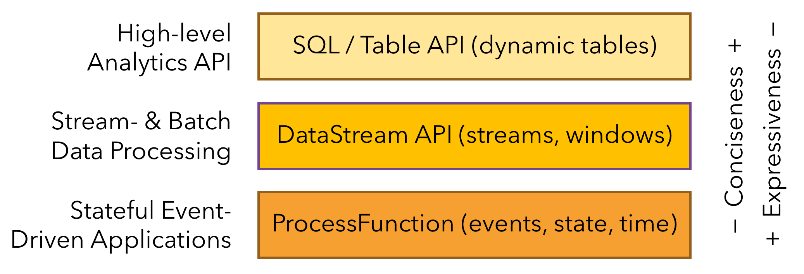

# What is Apache Flink? — Applications

Apache Flink는 **무한(unbounded)·유한(bounded) 데이터 스트림에 대한 상태 기반 연산**을 위한 프레임워크이다.  
서로 다른 추상화 수준의 **다층 API**와 대표적인 사용 사례를 위한 **전용 라이브러리**를 제공해 다양한 스트리밍 애플리케이션을 쉽게 구현할 수 있다.

### 스트리밍 애플리케이션의 구성 요소

스트림 처리 프레임워크로 만들 수 있는 애플리케이션의 범위는 **스트림, 상태, 시간**을 얼마나 잘 제어하느냐에 따라 결정된다.

### Streams

스트림은 스트리밍 처리의 핵심이며, 특성에 따라 처리 방식이 달라진다.

- **Unbounded / Bounded 스트림**
    - Unbounded: 끝이 없으며 지속적으로 처리 필요
    - Bounded: 크기가 고정된 데이터셋, 배치 처리 가능
- **실시간 / 기록된 스트림**
    - 실시간으로 생성되는 데이터를 즉시 처리
    - 파일 시스템·오브젝트 스토어 등에 저장 후 재처리 가능

Flink는 모든 유형의 스트림을 동일한 프레임워크에서 처리할 수 있다.

### State


실질적인 스트리밍 애플리케이션은 대부분 **상태(stateful)** 를 가진다.  
Flink에서는 상태가 **1급 시민(first-class citizen)** 이다.

- **다양한 상태 프리미티브**: 값, 리스트, 맵 등 제공
- **플러그형 State Backend**: 메모리 기반 또는 RocksDB 기반 선택 가능
- **Exactly-once 상태 일관성**: 장애 발생 시에도 상태 정확성 보장
- **대규모 상태 지원**: 수 TB 규모 상태 유지 가능
- **확장성**: 워커 수 증감 시 상태 재분배 지원

### Time

스트리밍 애플리케이션은 시간 개념에 크게 의존한다.

- **Event-time**
    - 이벤트 타임스탬프 기준 처리
    - 실시간·재처리 모두에서 일관된 결과 보장
- **Watermark**
    - 이벤트 시간 진행을 추론
    - 지연(latency)과 결과 완전성 간 트레이드오프 조절
- **Late Data 처리**
    - 지연 이벤트를 별도 출력하거나 기존 결과 갱신
- **Processing-time**
    - 처리 머신의 실제 시간 기준
    - 초저지연이 중요하고 근사 결과가 허용되는 경우 적합

### Layered APIs



Flink는 **표현력과 단순성의 균형**이 다른 세 가지 API를 제공한다.

### ProcessFunction

가장 표현력이 높은 API로, **상태와 시간에 대한 세밀한 제어**를 제공한다.

- 이벤트 단위의 복잡한 비즈니스 로직 구현 가능
- 상태 직접 수정 및 타이머 등록 가능
- 강력하지만 코드가 비교적 장황함

```java
/**
 * Matches keyed START and END events and computes the difference between
 * both elements' timestamps. The first String field is the key attribute,
 * the second String attribute marks START and END events.
 */
public static class StartEndDuration
        extends KeyedProcessFunction<String, Tuple2<String, String>, Tuple2<String, Long>> {

    private ValueState<Long> startTime;

    @Override
    public void open(Configuration conf) {
        // obtain state handle
        startTime = getRuntimeContext()
                .getState(new ValueStateDescriptor<Long>("startTime", Long.class));
    }

    /** Called for each processed event. */
    @Override
    public void processElement(
            Tuple2<String, String> in,
            Context ctx,
            Collector<Tuple2<String, Long>> out) throws Exception {

        switch (in.f1) {
            case "START":
                // set the start time if we receive a start event.
                startTime.update(ctx.timestamp());
                // register a timer in four hours from the start event.
                ctx.timerService()
                        .registerEventTimeTimer(ctx.timestamp() + 4 * 60 * 60 * 1000);
                break;
            case "END":
                // emit the duration between start and end event
                Long sTime = startTime.value();
                if (sTime != null) {
                    out.collect(Tuple2.of(in.f0, ctx.timestamp() - sTime));
                    // clear the state
                    startTime.clear();
                }
            default:
                // do nothing
        }
    }

    /** Called when a timer fires. */
    @Override
    public void onTimer(
            long timestamp,
            OnTimerContext ctx,
            Collector<Tuple2<String, Long>> out) {

        // Timeout interval exceeded. Cleaning up the state.
        startTime.clear();
    }
}
```

### DataStream API

가장 일반적으로 사용되는 스트리밍 API이다.

- map, reduce, aggregate, window 등 기본 연산 제공
- Java 함수 또는 람다 기반 정의
- 대부분의 실무 스트리밍 처리에 적합

````
// a stream of website clicks
DataStream<Click> clicks = ...

DataStream<Tuple2<String, Long>> result = clicks
  // project clicks to userId and add a 1 for counting
  .map(
    // define function by implementing the MapFunction interface.
    new MapFunction<Click, Tuple2<String, Long>>() {
      @Override
      public Tuple2<String, Long> map(Click click) {
        return Tuple2.of(click.userId, 1L);
      }
    })
  // key by userId (field 0)
  .keyBy(0)
  // define session window with 30 minute gap
  .window(EventTimeSessionWindows.withGap(Time.minutes(30L)))
  // count clicks per session. Define function as lambda function.
  .reduce((a, b) -> Tuple2.of(a.f0, a.f1 + b.f1));
````

### SQL & Table API

관계형 추상화를 제공하는 API이다.

- 스트림·배치 통합 처리
- Apache Calcite 기반 파싱·최적화
- ETL, 데이터 분석, 파이프라인 구성에 적합
- DataStream API와 자연스럽게 통합 가능

```sql
SELECT userId, COUNT(*)
FROM clicks
GROUP BY SESSION(clicktime, INTERVAL '30' MINUTE), userId
```

### Libraries

Flink는 공통 사용 사례를 위한 라이브러리를 제공한다.

- **CEP (Complex Event Processing)**
    - 이벤트 패턴 탐지용 라이브러리
    - 상태 머신·정규식 기반 패턴 정의
    - 침입 탐지, 비즈니스 프로세스 모니터링, 이상·사기 탐지에 활용
