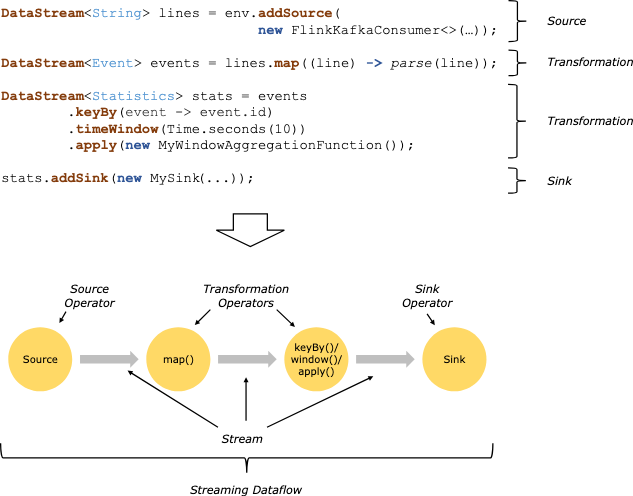
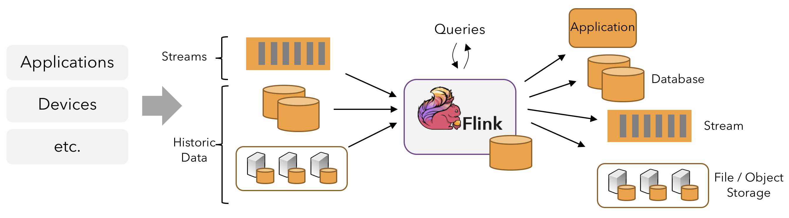
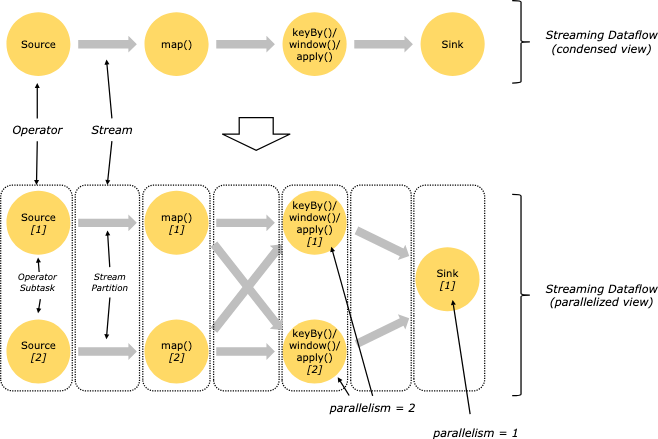
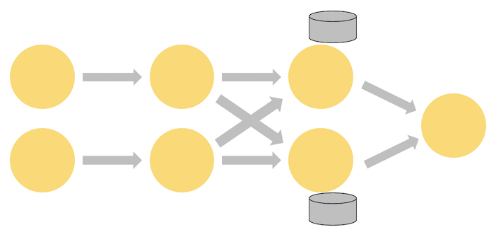
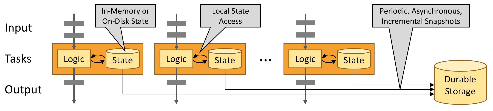

# Learn Flink: Hands-On Training

이 트레이닝은 Apache Flink를 처음 접하는 사용자를 대상으로, **확장 가능한 스트리밍 ETL, 분석, 이벤트 기반 애플리케이션을 작성하는 데 필요한 핵심만** 소개한다.  
상태(state)와 시간(time)을 다루는 Flink API의 기본 개념에 집중하며, 이를 바탕으로 이후 상세 문서를 학습할 수 있도록 돕는 것이 목적이다.

학습 내용:

- 스트리밍 데이터 처리 파이프라인 구현
- Flink의 상태 관리 방식과 그 이유
- 이벤트 시간을 활용한 정확한 분석
- 연속 스트림 기반 이벤트 중심 애플리케이션 구축
- Exactly-once 의미론을 갖는 장애 허용 스트림 처리

본 트레이닝은 다음 **네 가지 핵심 개념**에 초점을 둔다.

- 연속 스트림 처리
- 이벤트 시간
- 상태 기반 스트림 처리
- 상태 스냅샷

### Stream Processing

데이터는 본질적으로 **스트림 형태**로 생성된다. 웹 이벤트, 금융 거래, 센서 데이터 모두 스트림이다.  
데이터 처리는 **bounded(유한)** 또는 **unbounded(무한)** 스트림 중 어떤 모델을 선택하느냐에 따라 근본적으로 달라진다.

- **Bounded 스트림 (배치 처리)**
    - 입력이 유한
    - 전체 데이터를 수집한 뒤 처리 가능
    - 정렬, 전역 통계, 최종 리포트 생성에 적합
- **Unbounded 스트림 (스트림 처리)**
    - 입력이 끝나지 않음
    - 데이터 도착 즉시 지속적으로 처리 필요

Flink 애플리케이션은 **소스 → 연산자 → 싱크**로 구성된 스트리밍 데이터플로우 그래프로 표현된다.

### Program Dataflow

대부분의 경우 코드상의 변환은 데이터플로우의 연산자와 1:1로 대응되지만, 하나의 변환이 여러 연산자로 분해될 수도 있다.  
Flink는 Kafka, Kinesis 같은 실시간 소스뿐 아니라, 과거의 유한 데이터도 입력으로 사용할 수 있으며 결과 역시 다양한 시스템으로 출력 가능하다.

### Parallel Dataflows

Flink 프로그램은 **본질적으로 병렬·분산 실행**된다.

- 스트림은 여러 파티션으로 분할
- 연산자는 여러 서브태스크로 병렬 실행
- 연산자마다 서로 다른 병렬도 설정 가능

스트림 전송 방식:

- **One-to-one**
    - 파티션과 순서 유지
- **Redistributing**
    - 재파티셔닝(keyBy, broadcast, rebalance)
    - 서브태스크 간 전송 시 전역 순서는 보장되지 않음

### Timely Stream Processing

실시간 데이터와 과거 데이터를 **같은 코드로 처리하면서도 일관된 결과**를 얻는 것이 중요하다.  
이를 위해 Flink는 처리 시점이 아닌 **이벤트 발생 시점(event time)** 을 기준으로 계산한다.

이벤트 시간 처리는:

- 실제 발생 순서를 기준으로 분석 가능
- 결과가 언제 완성되었는지 판단 가능

### Stateful Stream Processing

Flink 연산은 **상태 기반**일 수 있다.

- 단순 예: 분당 이벤트 수 집계
- 복잡한 예: 사기 탐지 모델 특징 계산

병렬 실행 환경에서:

- 각 연산자 인스턴스는 특정 키 집합의 상태를 담당
- 전체적으로 보면 **샤딩된 키-값 저장소**와 유사
- 상태는 항상 로컬에서 접근 → 고성능, 저지연

상태 저장 위치:

- JVM 메모리
- 대규모 상태의 경우 디스크 기반 구조

### State Snapshots를 통한 장애 허용

Flink는 **상태 스냅샷 + 스트림 재생**으로 Exactly-once 의미론을 제공한다.

- 스냅샷은 전체 파이프라인의 상태와 입력 오프셋을 기록
- 장애 발생 시:
    - 소스를 되돌리고
    - 상태를 복원한 뒤
    - 중단 지점부터 처리 재개
- 스냅샷은 **비동기적으로 수행**되어 처리 지연에 거의 영향을 주지 않음
