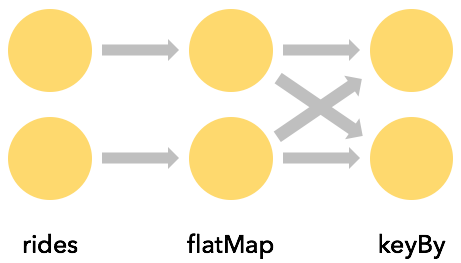
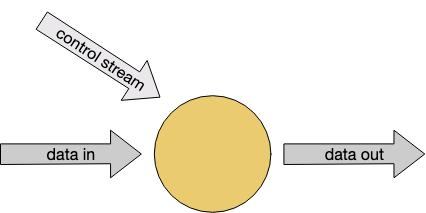

# Data Pipelines & ETL

Apache Flink의 대표적인 활용 사례 중 하나는 **ETL(Data Pipelines)** 이다.  
여러 소스로부터 데이터를 읽어 **변환·보강(enrichment)** 한 뒤 다른 시스템에 저장한다.  
이 절에서는 **DataStream API**를 사용해 이러한 파이프라인을 구현하는 핵심 개념을 다룬다.

Table / SQL API도 많은 ETL 시나리오에 적합하지만, **DataStream API의 기초 이해는 필수적**이다.

### Stateless Transformations

상태를 사용하지 않는 기본 변환 연산이다.

#### map()

- **1:1 변환**
- 입력 이벤트마다 정확히 하나의 출력 생성
- 예: 위치 좌표를 그리드 셀로 변환하여 이벤트 보강

```
DataStream<TaxiRide> rides = env.addSource(new TaxiRideSource(...));

DataStream<EnrichedRide> enrichedNYCRides = rides
    .filter(new RideCleansingSolution.NYCFilter()) // 필터 : 뉴욕시 내 택시 이동만
    .map(new Enrichment());

enrichedNYCRides.print();
```

```java
public static class EnrichedRide extends TaxiRide {
    public int startCell;
    public int endCell;

    public EnrichedRide() {
    }

    public EnrichedRide(TaxiRide ride) {
        this.rideId = ride.rideId;
        this.isStart = ride.isStart;
        // ...
        this.startCell = GeoUtils.mapToGridCell(ride.startLon, ride.startLat);
        this.endCell = GeoUtils.mapToGridCell(ride.endLon, ride.endLat);
    }

    public String toString() {
        // ...
    }
}

public static class Enrichment implements MapFunction<TaxiRide, EnrichedRide> {

    @Override
    public EnrichedRide map(TaxiRide taxiRide) throws Exception {
        return new EnrichedRide(taxiRide);
    }
}

```

#### flatMap()

- **1:N 또는 0:N 변환**
- Collector를 통해 여러 개 혹은 아무것도 출력하지 않을 수 있음
- 필터링 + 변환을 동시에 처리 가능

```
DataStream<TaxiRide> rides = env.addSource(new TaxiRideSource(...));

DataStream<EnrichedRide> enrichedNYCRides = rides
    .flatMap(new NYCEnrichment()); // filter + map

enrichedNYCRides.print();
```

```java
public static class NYCEnrichment implements FlatMapFunction<TaxiRide, EnrichedRide> {

    @Override
    public void flatMap(TaxiRide taxiRide, Collector<EnrichedRide> out) throws Exception {
        FilterFunction<TaxiRide> valid = new RideCleansing.NYCFilter();
        if (valid.filter(taxiRide)) {
            out.collect(new EnrichedRide(taxiRide));
        }
    }
}
```

### Keyed Streams

#### keyBy()

````
rides
    .flatMap(new NYCEnrichment())
    .keyBy(enrichedRide -> enrichedRide.startCell); // key by startCell    
````

스트림을 특정 키 기준으로 파티셔닝하여 **같은 키의 이벤트를 한 곳에서 처리**한다.



- keyBy는 **네트워크 셔플**을 유발 → 비용 큼
- 키는 결정적(deterministic)이어야 하며 hashCode/equals 필요
- 필드 추출뿐 아니라 **계산된 키**도 가능

````
// option 1
keyBy(enrichedRide -> enrichedRide.startCell);

// option 2
keyBy(ride -> GeoUtils.mapToGridCell(ride.startLon, ride.startLat));
````

#### Keyed Aggregations

- keyBy 이후 **maxBy, reduce 등 집계 연산** 가능
- 각 키별로 상태를 유지하며 결과 갱신
- 예: 시작 지점별 가장 긴 택시 이동 시간

```java
import org.joda.time.Interval;

DataStream<Tuple2<Integer, Minutes>> minutesByStartCell = enrichedNYCRides
        .flatMap(new FlatMapFunction<EnrichedRide, Tuple2<Integer, Minutes>>() {

            @Override
            public void flatMap(EnrichedRide ride,
                                Collector<Tuple2<Integer, Minutes>> out) throws Exception {
                if (!ride.isStart) {
                    Interval rideInterval = new Interval(ride.startTime, ride.endTime);
                    Minutes duration = rideInterval.toDuration().toStandardMinutes();
                    out.collect(new Tuple2<>(ride.startCell, duration));
                }
            }
        });
```

```
minutesByStartCell
  .keyBy(value -> value.f0) // .keyBy(value -> value.startCell)
  .maxBy(1) // duration
  .print();
```

```
...
4> (64549,5M)
4> (46298,18M)
1> (51549,14M)
1> (53043,13M)
1> (56031,22M)
1> (50797,6M)
...
1> (50797,8M)
...
1> (50797,11M)
...
1> (50797,12M)

```

### (암묵적) State

Keyed aggregation은 내부적으로 **상태(state)** 를 사용한다.

- 키 공간이 무한하면 상태도 무한히 증가
- 일반적으로 **전체 스트림 집계보다는 윈도우 기반 집계**가 적합

### Stateful Transformations

Flink가 상태를 직접 관리하는 이유:

- **로컬 접근**: 메모리 속도
- **내구성**: 체크포인트 기반 장애 복구
- **수직 확장**: RocksDB + 디스크
- **수평 확장**: 클러스터 크기에 따라 상태 재분배

### Rich Functions

RichFunction은 기본 함수에 다음 기능을 추가한다.

- `open()` / `close()`
- `getRuntimeContext()`
- 상태 생성 및 외부 리소스 초기화 가능

### Keyed State 예제

```java
private static class Event {
    public final String key;
    public final long timestamp;
    // ...
}

public static void main(String[] args) throws Exception {
    StreamExecutionEnvironment env = StreamExecutionEnvironment.getExecutionEnvironment();

    env.addSource(new EventSource())
            .keyBy(e -> e.key)
            .flatMap(new Deduplicator())
            .print();

    env.execute();
}

public static class Deduplicator extends RichFlatMapFunction<Event, Event> {
    ValueState<Boolean> keyHasBeenSeen;

    @Override
    public void open(OpenContext ctx) {
        ValueStateDescriptor<Boolean> desc = new ValueStateDescriptor<>("keyHasBeenSeen", Types.BOOLEAN);
        keyHasBeenSeen = getRuntimeContext().getState(desc);
    }

    @Override
    public void flatMap(Event event, Collector<Event> out) throws Exception {
        if (keyHasBeenSeen.value() == null) {
            out.collect(event);
            keyHasBeenSeen.update(true);
        }
    }
}

```

중복 이벤트 제거 예제:

- 키별로 이벤트를 **한 번만 통과**
- `ValueState<Boolean>` 사용
- 상태는 Flink 런타임이 키에 따라 자동 분리 관리

이 하나의 ValueState는 실제로는 **분산된 key-value 저장소**를 의미한다.

### State 정리 (clearing State)

- 키 공간이 무한하면 상태 정리가 필요
- `state.clear()`로 수동 정리
- State TTL 설정으로 자동 정리 가능
- 타이머(ProcessFunction)와 함께 자주 사용됨

### Non-keyed State

- 연산자 단위 상태 (Operator State)
- 주로 Source / Sink 구현에 사용
- 일반 사용자 로직에서는 드물게 사용

### Connected Streams


두 개의 스트림을 **하나의 연산자로 연결**하여 처리한다.

- 동적 규칙, 제어 스트림, 스트리밍 조인에 유용
- 두 스트림은 **동일한 keyBy 방식** 필요
- 키별 상태를 두 스트림이 공유 가능



### Connected Streams 예제

```java
public static void main(String[] args) throws Exception {
    StreamExecutionEnvironment env = StreamExecutionEnvironment.getExecutionEnvironment();

    DataStream<String> control = env
            .fromData("DROP", "IGNORE")
            .keyBy(x -> x);

    DataStream<String> streamOfWords = env
            .fromData("Apache", "DROP", "Flink", "IGNORE")
            .keyBy(x -> x);

    control.connect(streamOfWords)
            .flatMap(new ControlFunction())
            .print();

    env.execute();
}

public static class ControlFunction extends RichCoFlatMapFunction<String, String, String> {
    private ValueState<Boolean> blocked;

    @Override
    public void open(OpenContext ctx) {
        blocked = getRuntimeContext()
                .getState(new ValueStateDescriptor<>("blocked", Boolean.class));
    }

    @Override
    public void flatMap1(String control_value, Collector<String> out) throws Exception {
        blocked.update(Boolean.TRUE);
    }

    @Override
    public void flatMap2(String data_value, Collector<String> out) throws Exception {
        if (blocked.value() == null) {
            out.collect(data_value);
        }
    }
}

```

- 제어 스트림에서 차단할 키를 전달
- 데이터 스트림에서 해당 키의 이벤트 필터링
- `RichCoFlatMapFunction` 사용
- 두 입력 스트림은 **경쟁적으로 소비**되므로 순서 보장 없음
- 순서·타이밍이 중요하면 상태에 이벤트를 버퍼링해야 함
