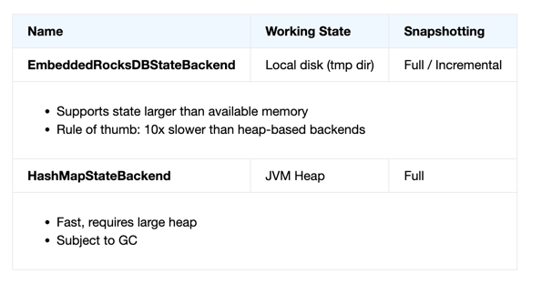
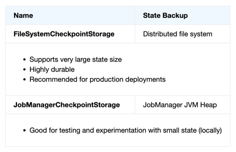
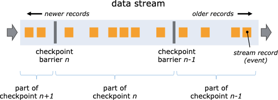
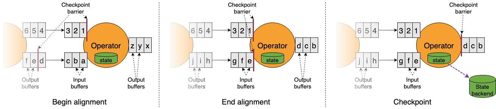

# Fault Tolerance via State Snapshots

Flink가 관리하는 상태(state)는 **키별로 샤딩된 key/value 저장소** 형태이며,  
각 키의 상태는 해당 키를 담당하는 **TaskManager 로컬**에 유지된다.  
이 상태는 **State Backend**에 저장된다.

Flink는 대표적으로 두 가지 State Backend를 제공한다.

- **EmbeddedRocksDBStateBackend**
    - 작업 상태 저장 위치: 로컬 디스크
    - 스냅샷 방식: 전체 / 증분(incremental)
    - 메모리보다 큰 상태 지원
    - 힙 기반 대비 대략 10배 느림
    - 대규모 상태에 적합

- **HashMapStateBackend**
    - 작업 상태 저장 위치: JVM 힙
    - 스냅샷 방식: 전체(full)
    - 매우 빠르지만 큰 힙 필요
    - GC 영향 큼
    - 소규모 상태에 적합

RocksDB 기반 백엔드는 (역직렬화 비용은 있지만) **디스크 크기만큼 상태 확장 가능**하며,  
**증분 스냅샷을 지원**한다는 점이 대규모 상태에서 큰 장점이다.

두 백엔드 모두 **비동기 스냅샷**을 지원하여,  
스냅샷 중에도 스트림 처리가 멈추지 않는다.

### Checkpoint Storage

State Backend가 “작업 중 상태”를 저장한다면,  
Checkpoint Storage는 **스냅샷을 영구 저장**하는 위치다.

- **FileSystemCheckpointStorage**
    - 저장 위치: 분산 파일 시스템
    - 대규모 상태 지원
    - 내구성 높음
    - **운영 환경 권장**

- **JobManagerCheckpointStorage**
    - 저장 위치: JobManager JVM 힙
    - 소규모 상태에 적합
    - 테스트 / 로컬 실험용

### State Snapshots 용어 정리

- **Snapshot**
    - Flink 잡 전체 상태의 일관된 시점 이미지
    - 소스 오프셋 + 모든 연산자의 상태 포함

- **Checkpoint**
    - Flink가 자동으로 생성하는 스냅샷
    - 장애 복구 목적
    - 빠른 복구에 최적화
    - 증분 가능

- **Externalized Checkpoint**
    - 잡 종료 후에도 삭제되지 않는 체크포인트
    - 수동 복구 가능

- **Savepoint**
    - 사용자가 수동으로 트리거하는 스냅샷
    - 배포, 업그레이드, 스케일링 용도
    - 항상 전체 스냅샷
    - 운영 유연성에 최적화

### State Snapshot 동작 방식

Flink는 **Chandy-Lamport 알고리즘을 변형한 비동기 배리어 스냅샷 방식**을 사용한다.

동작 흐름은 다음과 같다.

- Checkpoint Coordinator가 체크포인트 시작 지시
- 각 Source가:
    - 현재 오프셋 기록
    - **Checkpoint Barrier**를 스트림에 삽입
- Barrier는 데이터와 함께 downstream으로 흐름
- 연산자는:
    - Barrier 이전 데이터까지의 상태를 스냅샷
    - Barrier 이후 데이터는 다음 체크포인트에 포함

두 입력 스트림을 가진 연산자는 **Barrier Alignment**를 수행해  
양쪽 스트림 모두에서 동일한 체크포인트 시점을 맞춘다.

State Backend는 **Copy-on-Write** 방식으로:

- 스냅샷 중에도 상태 변경 허용
- 스냅샷 완료 후 오래된 상태 정리

### Exactly-Once 보장

Flink의 장애 처리 결과는 다음 중 하나가 될 수 있다.

- **At-most-once**
    - 중복 없음, 데이터 손실 가능

- **At-least-once**
    - 데이터 손실 없음, 중복 가능

- **Exactly-once**
    - 상태에 대한 영향이 정확히 한 번만 반영됨

여기서 **Exactly-once**란:
> “각 이벤트가 Flink의 상태에 정확히 한 번만 반영된다”는 의미  
(이벤트 자체가 물리적으로 한 번만 처리된다는 뜻은 아님)

Barrier Alignment는 exactly-once 보장을 위해 필요하며,  
`CheckpointingMode.AT_LEAST_ONCE`로 설정하면 정렬을 생략해 성능을 높일 수 있다.

### End-to-End Exactly-Once

소스부터 싱크까지 완전한 exactly-once를 달성하려면:

- **소스는 재생 가능**해야 하고
- **싱크는 트랜잭션 기반이거나 idempotent**해야 한다

이 조건이 충족될 때,  
장애 발생 후에도 데이터 손실이나 중복 없이 처리가 이어진다.
