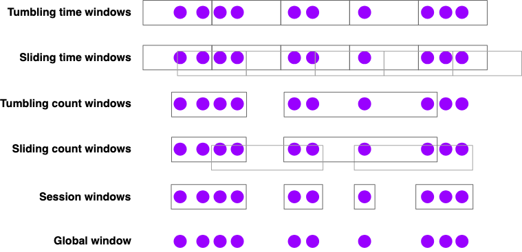

# Streaming Analytics

Flink는 스트리밍 분석을 위해 세 가지 시간 개념을 명확히 구분한다.

- Event Time: 이벤트가 실제로 발생한 시각
- Ingestion Time: Flink가 이벤트를 수집한 시각
- Processing Time: 연산자가 이벤트를 처리하는 시각

재현 가능하고 일관된 분석을 위해서는 Event Time 사용이 권장된다.  
Processing Time 기반 분석은 지연이나 처리 순서에 따라 결과가 달라질 수 있어, 과거 데이터 재처리나 테스트에 부적합하다.

- Event Time과 Watermark는 정확한 스트리밍 분석의 핵심이다
- Watermark는 기다림을 멈출 시점을 정의한다
- Window는 무한 스트림을 유한 집계로 변환한다
- Incremental Aggregation이 성능과 확장성에 유리하다
- Late data 처리는 반드시 명시적으로 설계해야 한다

### Watermarks

스트리밍 환경에서는 이벤트가 **발생한 순서(event time)** 와  
**도착한 순서(processing order)** 가 일치하지 않는 경우가 매우 흔하다.

다음은 이벤트가 실제로 발생한 시간(timestamp)을 기준으로 한 예시다.
오른쪽 화살표 방향이 “도착 순서”다.

23 19 22 24 21 14 17 13 12 15 9 11 7 2 4 →

즉,

- 가장 먼저 도착한 이벤트는 timestamp = 4
- 그 뒤에 timestamp = 2 같은 더 과거 이벤트가 나중에 도착한다

이처럼 **out-of-order 이벤트**가 존재하면, 단순한 스트림 처리는 문제가 된다.

### 예제: 스트림 정렬기(Stream Sorter)

가정:

- 입력 스트림을 도착하는 즉시 처리
- 출력은 timestamp 기준으로 정렬된 스트림

#### 관찰 1: 바로 출력할 수 없다

첫 이벤트로 timestamp 4가 도착했지만,

- 이후 timestamp 2가 도착할 수 있다
- 따라서 4를 바로 출력하면 정렬이 깨진다

→ **일부 이벤트를 버퍼링하고 기다려야 한다**

#### 관찰 2: 무한 대기의 위험

4 다음에 2가 도착했다면,

- 이제 2를 출력해도 될까?
- 혹시 1이 더 늦게 도착하지는 않을까?

이 질문에 명확한 기준이 없으면,

- “혹시 더 작은 값이 오지 않을까?” 하며
- **영원히 기다릴 수 있다**

→ 반드시 “이제 그만 기다려도 된다”는 기준이 필요하다

#### 관찰 3: 기다림을 멈출 정책이 필요하다

각 timestamp에 대해 다음을 결정해야 한다.

- 언제까지 과거 이벤트를 기다릴 것인가?
- 언제 결과를 확정하고 출력할 것인가?

이 역할을 수행하는 것이 바로 **Watermark**다.

### Watermark란 무엇인가

Watermark는 스트림에 삽입되는 **특별한 시간 신호**다.

- Watermark(t)의 의미:
    - “timestamp ≤ t 인 이벤트는 이제 거의 다 도착했다”
    - “이 시점 이전의 결과를 확정해도 된다”

즉, Watermark는 **기다림을 멈출 시점**을 정의한다.

### Watermark와 스트림 정렬기 예제

앞선 예제에서 질문은 이것이다.

> 언제 timestamp = 2 를 출력해도 안전한가?

정답:

- **Watermark(2) 또는 그보다 큰 Watermark가 도착했을 때**

이 순간,

- “2보다 작은 이벤트는 더 이상 오지 않을 것이다”라고 가정
- 2를 정렬된 스트림의 첫 원소로 출력 가능

### Watermark 생성 정책

Watermark는 자동으로 생기지 않는다.
**Watermark Generator**가 생성한다.

#### Bounded Out-of-Orderness 전략

가장 널리 쓰이는 방식이다.

가정:

- 이벤트는 최대 N만큼만 늦게 도착한다

정책:

- 현재까지 관측한 최대 event time = maxTs
- 현재 watermark = maxTs - N

예시:

- 최대 지연 허용: 5초
- 지금까지 본 가장 큰 timestamp = 20
- watermark = 15

→ timestamp ≤ 15 인 이벤트는 이제 끝났다고 판단

이 방식은 단순하지만,

- 대부분의 실무 스트리밍 애플리케이션에 충분히 효과적이다

### Watermark의 본질

Watermark는 **사실(fact)** 이 아니라 **추정(heuristic)** 이다.

- “아마도 이제 이 시점 이전 이벤트는 끝났을 것이다”
- 늦게 도착하는 이벤트(late event)가 생길 수도 있음

그래서 Flink는:

- late event 처리 정책
- allowed lateness
- side output

같은 기능을 함께 제공한다.

### 핵심 요약

- 스트림에서는 이벤트가 순서 없이 도착한다
- 결과를 내기 위해서는 “언제까지 기다릴지” 결정해야 한다
- Watermark는 그 결정을 내리는 기준이다
- Watermark(t)는 “t 이전은 거의 끝났다”는 선언이다
- Bounded out-of-orderness는 가장 일반적인 Watermark 생성 전략이다

### Event Time 처리와 Watermarks

Event Time 기반 처리를 위해 Flink는 다음을 필요로 한다.

- Timestamp Extractor: 이벤트에서 발생 시각 추출
- Watermark Generator: Event Time 진행 상황 표시

Watermark는  
“이 시각 이전의 이벤트는 거의 모두 도착했다”  
라는 추정을 의미하며, 언제까지 기다릴지를 결정하는 기준이 된다.

대표적인 방식은 Bounded Out-of-Orderness로,  
이벤트 지연이 최대 N초라고 가정하는 방식이다.

### Latency와 Completeness의 트레이드오프

Watermark는 지연시간과 결과 정확성 사이의 균형을 조절한다.

- 짧은 지연 허용: 빠르지만 불완전할 수 있음
- 긴 지연 허용: 느리지만 더 정확함
- 초기 결과 후 late data로 보정하는 하이브리드 방식도 가능

### Lateness

- Watermark(t) 이후 도착
- timestamp ≤ t 인 이벤트는 late event
- 기본 동작은 late event를 드롭

### Watermarks 설정

Event Time 처리를 위해 WatermarkStrategy를 사용한다.

- 이벤트에서 timestamp 추출
- Watermark 생성 정책 정의
- 스트림에 적용하여 Event Time 활성화

````
DataStream<Event> stream = ...;

WatermarkStrategy<Event> strategy = WatermarkStrategy
        .<Event>forBoundedOutOfOrderness(Duration.ofSeconds(20))
        .withTimestampAssigner((event, timestamp) -> event.timestamp);

DataStream<Event> withTimestampsAndWatermarks = stream.assignTimestampsAndWatermarks(strategy);
````

### Windows 개요

Windows는 무한 스트림을 유한 단위로 묶어 집계하기 위한 핵심 개념이다.

기본 구성 요소:

- Window Assigner
- Window Function
- Trigger
- Evictor

기본 사용 패턴:
keyBy → window → reduce / aggregate / process

### Window Assigners



Flink에서 제공하는 주요 Window 타입은 다음과 같다.

- Tumbling Windows  
  고정 크기, 겹침 없음  
  예: 분당 페이지 뷰

- Sliding Windows  
  겹치는 윈도우  
  예: 1분 윈도우를 10초마다 계산

- Session Windows  
  활동 간 gap 기준  
  예: 30분 비활동 시 세션 종료

- Global Windows  
  모든 이벤트를 하나의 윈도우로 처리  
  커스텀 Trigger 필요

모든 시간 기반 Window는 Event Time / Processing Time 버전이 있으며,  
Processing Time은 저지연 대신 비결정성을 감수해야 한다.

### Window Functions

윈도우 내부 데이터를 처리하는 방식은 세 가지다.

1. ProcessWindowFunction

- 윈도우 내 모든 이벤트를 버퍼링 후 처리
- 유연하지만 메모리 비용 큼

````
DataStream<SensorReading> input = ...;

input.keyBy(x -> x.key)
    .window(TumblingEventTimeWindows.of(Duration.ofMinutes(1)))
    .process(new MyWastefulMax());

public static class MyWastefulMax extends ProcessWindowFunction<
        SensorReading,                  // input type
        Tuple3<String, Long, Integer>,  // output type
        String,                         // key type
        TimeWindow> {                   // window type
    
    @Override
    public void process(
            String key,
            Context context, 
            Iterable<SensorReading> events,
            Collector<Tuple3<String, Long, Integer>> out) {

        int max = 0;
        for (SensorReading event : events) {
            max = Math.max(event.value, max);
        }
        out.collect(Tuple3.of(key, context.window().getEnd(), max));
    }
}
````

```java
public abstract class Context implements java.io.Serializable {
    public abstract W window();

    public abstract long currentProcessingTime();

    public abstract long currentWatermark();

    public abstract KeyedStateStore windowState();

    public abstract KeyedStateStore globalState();

    public abstract <X> void output(OutputTag<X> outputTag, X value);
}
```

2. Incremental Aggregation

- ReduceFunction / AggregateFunction 사용
- 메모리 효율적

````
DataStream<SensorReading> input = ...;

input.keyBy(x -> x.key)
    .window(TumblingEventTimeWindows.of(Duration.ofMinutes(1)))
    .reduce(new MyReducingMax(), new MyWindowFunction());

private static class MyReducingMax implements ReduceFunction<SensorReading> {
    public SensorReading reduce(SensorReading r1, SensorReading r2) {
        return r1.value() > r2.value() ? r1 : r2;
    }
}

private static class MyWindowFunction extends ProcessWindowFunction<
    SensorReading, Tuple3<String, Long, SensorReading>, String, TimeWindow> {

    @Override
    public void process(
            String key,
            Context context,
            Iterable<SensorReading> maxReading,
            Collector<Tuple3<String, Long, SensorReading>> out) {

        SensorReading max = maxReading.iterator().next();
        out.collect(Tuple3.of(key, context.window().getEnd(), max));
    }
}

````

3. 혼합 방식

- 사전 집계 + ProcessWindowFunction

실무에서는 2번 또는 3번 방식이 권장된다.

### Late Events 처리

Event Time 윈도우에서 late data를 다루는 방법은 다음과 같다.

- Side Output
    - 버려질 이벤트를 별도 스트림으로 분리

- Allowed Lateness
    - 지정 시간까지 늦은 이벤트 허용
    - late event 도착 시 윈도우 재실행

````
OutputTag<Event> lateTag = new OutputTag<Event>("late"){};

SingleOutputStreamOperator<Event> result = stream
    .keyBy(...)
    .window(...)
    .sideOutputLateData(lateTag)
    .process(...);
  
DataStream<Event> lateStream = result.getSideOutput(lateTag);
````

### Window 관련 주의사항

- Sliding Window는 이벤트 복제가 발생한다
- Time Window는 epoch 기준으로 정렬된다
- 윈도우 위에 다시 윈도우를 적용할 수 있다
- 이벤트가 없는 구간은 결과가 생성되지 않는다
- Session Window는 late event로 인해 병합될 수 있다

