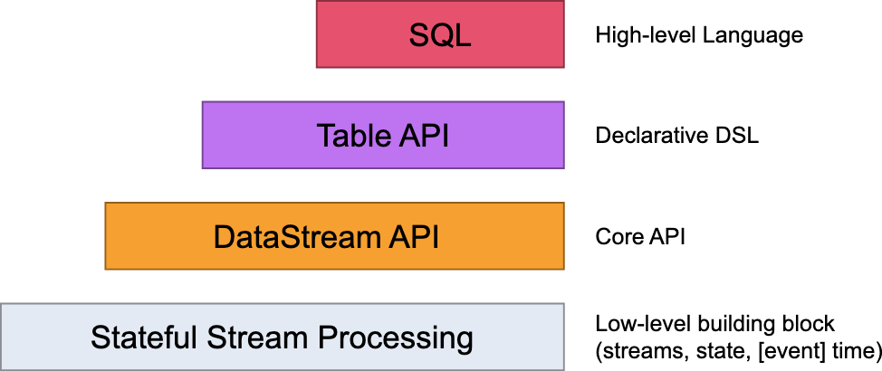

# Overview

Hands-on Training에서는 Flink API의 기반이 되는 **상태 기반(stateful)** 및 **시간 인지(timely) 스트림 처리**의 기본 개념을 설명하고, 이를 애플리케이션에서 어떻게
사용하는지 예제로 다룬다.  
상태 기반 스트림 처리는 **Data Pipelines & ETL**과 **Fault Tolerance**에서,  
시간 인지 스트림 처리는 **Streaming Analytics**에서 소개된다.

이 섹션은 한 단계 더 나아가, **Flink의 아키텍처와 런타임이 이러한 개념을 어떻게 구현하는지**를 심층적으로 설명한다.

Flink의 API는 다음과 같은 계층 구조를 가진다:

- SQL: 가장 선언적, 가장 간결
- Table API: 선언적, 최적화 지원
- DataStream API: 범용 스트림 처리
- Process Function: 최대 제어력, 저수준

애플리케이션의 복잡도와 요구사항에 따라  
**필요한 수준의 추상화를 선택하거나 조합**하는 것이 Flink 설계

## Flink의 API 계층

Flink는 **여러 수준의 추상화 레벨**을 제공하여, 스트리밍 및 배치 애플리케이션 개발을 지원한다.

### 저수준 추상화: Process Function

가장 낮은 수준의 추상화는 **상태 기반 + 시간 인지 스트림 처리** 그 자체를 제공한다.  
이는 **DataStream API 내부의 Process Function**으로 제공된다.

특징:

- 하나 이상의 스트림에서 이벤트를 자유롭게 처리 가능
- 일관되고 장애 허용(fault-tolerant) 상태 관리
- 이벤트 타임 / 처리 타임 기반 타이머 등록 가능
- 매우 복잡하고 정교한 로직 구현 가능

이 레벨은 최대한의 제어력을 제공하지만, 구현 난이도가 높다.

### Core APIs: DataStream API

대부분의 애플리케이션은 저수준 API까지 필요하지 않으며,  
**DataStream API**만으로 충분하다.

특징:

- 유한/무한 스트림 모두 처리
- map, filter, join, aggregate, window 등 표준 연산 제공
- 상태 관리 및 시간 처리 내장
- 처리되는 데이터는 프로그래밍 언어의 클래스(POJO 등)로 표현

Process Function은 DataStream API와 통합되어 있어,  
필요한 경우에만 저수준 기능을 부분적으로 사용할 수 있다.

### 선언적 API: Table API

Table API는 **테이블 중심의 선언적 DSL**이다.

특징:

- 스트림을 **동적으로 변하는 테이블**로 표현
- 스키마가 명확히 정의된 관계형 모델 사용
- select, project, join, group-by, aggregate 등 제공
- “무엇을 할 것인가”를 선언적으로 기술
- 옵티마이저를 통해 실행 전 최적화 수행
- 코드량이 적고 가독성이 높음

다만, Core API보다 표현력은 제한적이다.

### 최고 수준 추상화: SQL

SQL은 Flink가 제공하는 **가장 높은 수준의 추상화**다.

특징:

- Table API와 동일한 의미론과 표현력
- 프로그램을 SQL 쿼리로 표현
- Table API와 긴밀히 통합
- Table API에서 정의한 테이블 위에서 SQL 실행 가능

SQL은 분석 및 ETL 중심 워크로드에 특히 적합하다.

### API 간 연동

- **DataStream ↔ Table** 상호 변환 가능
- 하나의 애플리케이션에서
    - DataStream API + Process Function
    - Table API
    - SQL
      을 혼합 사용 가능

이를 통해 **간결함 ↔ 표현력** 사이에서 유연한 선택이 가능하다.
