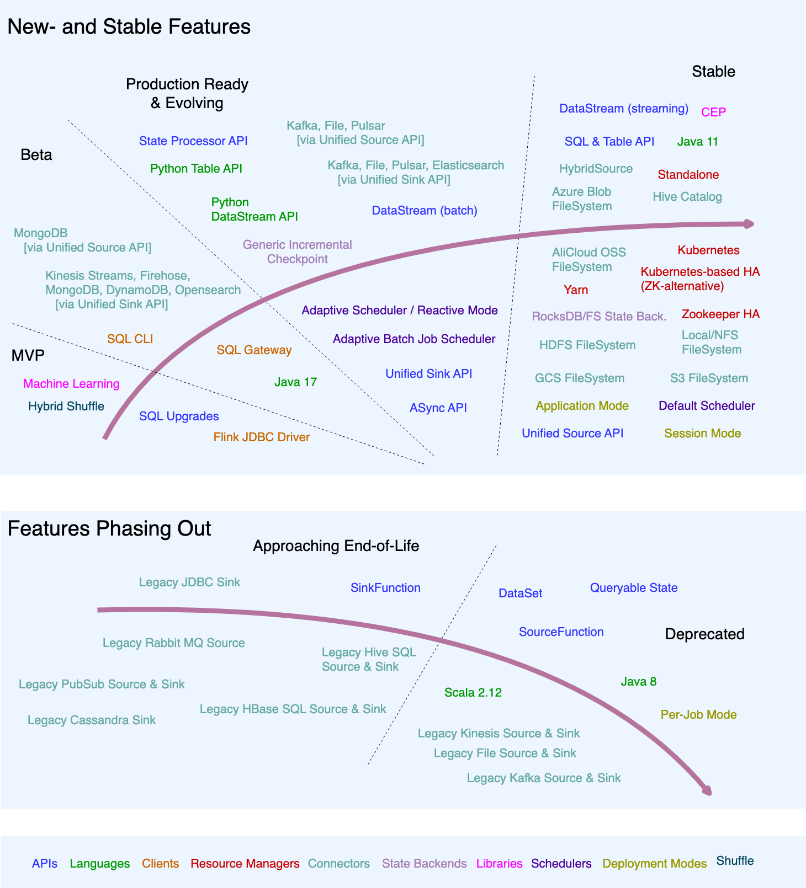

# Roadmap

이 로드맵은 Apache Flink의 **주요 개발 방향과 진행 중인 노력**을 큰 흐름 단위로 요약한 것이다.  
초기 단계부터 거의 완료된 기능까지 포함하여, 프로젝트의 **현재 상태와 미래 방향성**을 이해하는 데 목적이 있다.  
세부 변경 사항은 FLIP 문서에 정리되어 있으며, 로드맵은 지속적으로 업데이트된다.  
(Last Update: 2023-09-01)

### Feature Radar & 성숙도 단계

기능 성숙도와 수명 주기를 안내한다.

- **MVP**: 개념 검토 단계
- **Beta**: 사용 가능하나 신중한 평가 필요
- **Ready and Evolving**: 프로덕션 사용 가능, 향후 변경 가능성 존재
- **Stable**: 안정적, 자유로운 프로덕션 사용
- **Approaching End-of-Life**: 사용 가능하나 대안 고려 필요
- **Deprecated**: 즉시 대안 검토 권장

### Batch / Streaming 통합과 혼합

Flink는 본질적으로 **스트리밍 중심 시스템**이며, 배치를 스트리밍의 특수한 경우로 처리한다.

- DataStream API와 SQL에서 배치·스트림 통합 실행 지원
- 통합 Source API, SinkV2 API 도입
- 향후 배치/스트리밍 **혼합 실행 및 전환** 목표
- 배치로 상태를 부트스트랩 후 스트리밍으로 전환
- bounded/unbounded 경계 이벤트 알림 및 동적 체크포인트 간격 도입

### Unified SQL Platform

Flink는 **배치·스트리밍 통합 SQL 분석 플랫폼**으로 진화 중이다.

- 동일 SQL을 배치/스트림에서 동일 의미로 실행
- 효율적인 통합 쿼리 엔진과 다양한 커넥터 제공
- 사용자 피드백 기반 지속적 개선

### SQL 엔진을 넘어선 확장

- SQL 기반 잡 업데이트 시 복원 문제 개선 (FLIP-190)
- DELETE/UPDATE, 프로시저 호출, 풍부한 DDL, Time Travel 지원
- Lakehouse(Paimon/Iceberg/Hudi) 시나리오 강화
- JSON 타입 지원 논의로 반정형 데이터 분석 강화

### 플랫폼 인프라

- SQL Client 사용성 개선
- SQL Gateway 강화 (Application Mode, JDBC Driver, HA, 인증)
- 프로덕션급 SQL 플랫폼 구축 용이성 향상

### 공통 언어 및 SQL 방언 지원

- Hive SQL 문법 호환성 94% 이상
- 플러그형 SQL Dialect 구조 도입
- 향후 Spark SQL, PostgreSQL 문법 확장 가능

### Streaming Warehouse 방향

Flink는 **Streaming Warehouse** 개념을 통해 계산뿐 아니라 **스토리지까지 실시간 통합**을 목표로 한다.

- Apache Paimon을 통한 스트리밍·배치 통합 스토리지
- 실시간으로 항상 최신 상태의 데이터 웨어하우스
- OLAP을 배치의 특수한 경우로 처리하는 방향 탐색
- 짧은 실행 시간의 OLAP 쿼리 지원 목표

### 엔진 진화

#### 상태 관리 분리(Disaggregated State)

- 계산과 상태 관리 분리 → 클라우드 네이티브 구조
- DFS 기반 공유 상태, 체크포인트 재사용
- 더 빠른 스냅샷·복구, 부하 분산 개선

#### API 진화

- Flink 2.0에서 오래된 API 제거
    - DataSet API, Scala API, SinkV1, 레거시 Source/Sink
- 장기적으로 새로운 ProcessFunction API 설계
- 내부 구현 의존성 문제 완화 목표

### Flink를 애플리케이션으로

- 클러스터 제출 방식 → **애플리케이션 배포 방식**
- Kubernetes Operator 기반 운영
- SQL 잡의 Application Mode 실행 지원

### 성능 개선

- 대규모 스트리밍 조인 최적화
- CDC 성능 개선
- 배치 성능 강화(DPP, Runtime Filter, Operator Fusion)
- 적응형 실행 계획 및 OLAP 지원

### 안정성

- 장애 허용성 및 복구 속도 개선
- 배치 잡에서 speculative execution 강화
- JobManager 장애 시 재실행 최소화 목표

### 사용성 개선

- 설정 옵션 수 감소 및 자동화
- 합리적인 기본값 제공
- 내부 지식 없이도 튜닝 가능하도록 개선
- Hybrid Shuffle 등으로 설정 부담 감소

### 생태계

- 커넥터 외부 저장소 관리
- Catalog를 1급 시민으로 강화
- 다양한 외부 시스템 커넥터 확장

### 문서화

- 문서 구조 단순화 및 가독성 개선
- Docs 기술 스택 및 SQL 문서 정비
