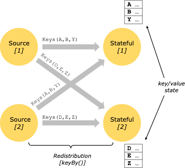
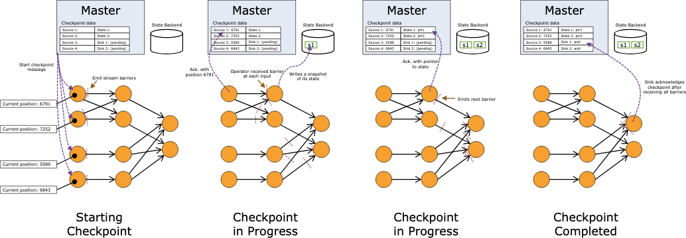
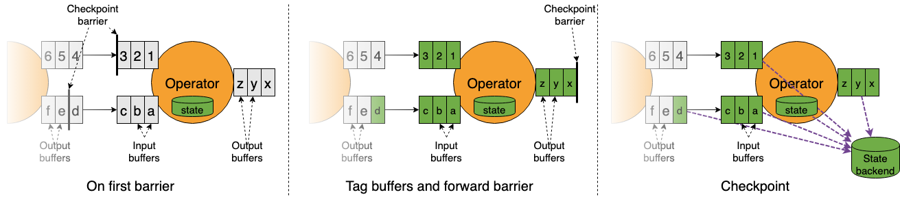
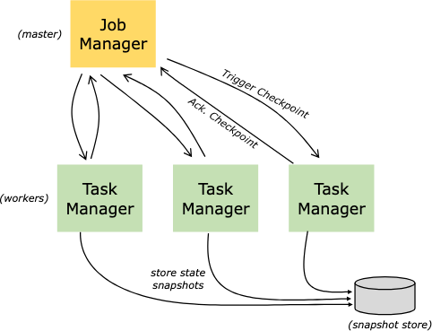

# Stateful Stream Processing

## What is State?

데이터플로우의 많은 연산은 **이벤트 하나만 보고 처리**하지만,  
일부 연산은 **여러 이벤트에 걸친 정보를 기억**해야 한다. 이런 연산을 **상태 기반(stateful)** 연산이라고 한다.

대표적인 예시는 다음과 같다.

- 이벤트 패턴 탐지: 지금까지 관측된 이벤트 시퀀스를 상태로 저장
- 시간 단위 집계: 분/시간/일 단위의 누적 값 보관
- 스트리밍 머신러닝: 현재 모델 파라미터를 상태로 유지
- 과거 데이터 관리: 이전 이벤트를 효율적으로 조회

Flink는 이 상태를 **checkpoint와 savepoint**를 통해 장애 허용적으로 관리하며,  
상태 정보를 알고 있기 때문에 **애플리케이션 리스케일링 시 상태 재분배**도 자동으로 처리한다.

## Keyed State

Keyed State는 **내장된 key/value 저장소**처럼 동작한다.

### 핵심 특징

- 상태는 **스트림 파티셔닝과 정확히 정렬**됨
- keyed/partitioned 스트림에서만 접근 가능
- 현재 이벤트의 key에 해당하는 상태만 접근 가능
- 모든 상태 접근이 **로컬 연산** → 트랜잭션 오버헤드 없이 일관성 보장

이 구조 덕분에 Flink는:

- 상태 재분배를 투명하게 수행
- 병렬도 변경 시에도 정확성 유지

### Key Groups

Keyed State는 **Key Group** 단위로 관리된다.

- Key Group = 상태 재분배의 최소 단위
- Key Group 수 = maximum parallelism
- 각 병렬 인스턴스는 하나 이상의 Key Group 담당

## State Persistence

Flink의 장애 허용은 **스트림 재생 + 체크포인트**의 결합으로 구현된다.

### 기본 원리

- 체크포인트는:
    - 각 소스 스트림의 특정 위치
    - 그 시점까지의 연산자 상태
      를 함께 기록
- 장애 발생 시:
    - 최신 체크포인트로 상태 복원
    - 소스를 체크포인트 위치부터 재생
- 결과적으로 **exactly-once 처리 의미론** 유지

체크포인트 주기는:

- 실행 중 오버헤드 ↔ 장애 복구 시간
  사이의 트레이드오프를 결정한다.

기본적으로 체크포인트는 비활성화되어 있으며,  
Kafka처럼 **스트림 rewind가 가능한 소스**가 필요하다.

## Checkpointing

체크포인트는 **분산 스트리밍 데이터플로우의 일관된 스냅샷**이다.

- Chandy-Lamport 알고리즘 기반
- Flink 실행 모델에 맞게 최적화
- **완전히 비동기적**으로 수행 가능

### Barriers

체크포인트의 핵심은 **스트림 배리어(barrier)** 다.

- 배리어는 데이터와 함께 스트림을 따라 이동
- 레코드를 추월하지 않음
- 배리어 이전 데이터 → 현재 스냅샷
- 배리어 이후 데이터 → 다음 스냅샷
- 여러 체크포인트 배리어가 동시에 존재 가능

소스에서 배리어가 삽입되고,  
모든 싱크가 배리어를 확인하면 체크포인트는 완료된다.

## Barrier Alignment

다중 입력 연산자는 **배리어 정렬(alignment)** 이 필요하다.

### 동작 방식

- 한 입력에서 배리어 도착 시:
    - 다른 입력의 배리어가 올 때까지 해당 입력 처리 중단
- 모든 입력에서 배리어 수신 후:
    - 상태 스냅샷
    - 배리어 downstream 전파
    - 처리 재개

이는 스냅샷 n과 n+1의 데이터가 섞이는 것을 방지하기 위함이다.

## Snapshotting Operator State

상태를 가진 연산자는:

- 모든 입력에서 배리어를 받은 시점에 상태 스냅샷
- 스냅샷은 **State Backend**에 저장
- 저장 후 체크포인트 완료를 알림

스냅샷에는 다음이 포함된다.

- 각 소스의 스트림 위치
- 각 연산자의 상태 포인터

## Recovery

장애 발생 시 복구 과정은 단순하다.

- 최신 완료 체크포인트 선택
- 전체 데이터플로우 재배포
- 연산자 상태 복원
- 소스는 체크포인트 위치부터 재생

증분 스냅샷의 경우:

- 마지막 전체 스냅샷
- 이후 증분 업데이트를 순차 적용

## Unaligned Checkpointing

정렬 없이 체크포인트를 수행하는 방식도 있다.

### 특징

- 첫 배리어 수신 즉시 처리
- in-flight 데이터도 상태로 포함
- 배리어를 빠르게 downstream 전파
- 느린 경로가 있는 잡에 특히 효과적

단점:

- 상태 백엔드 I/O 부하 증가
- I/O 병목 상황에서는 효과 제한
- **Savepoint는 항상 aligned**

## State Backends

State Backend는 **key/value 상태를 실제로 어떤 자료구조에 저장할지**와  
**그 상태를 시점 스냅샷으로 만드는 방법**을 정의하는 구성 요소다.

Flink는 애플리케이션 로직을 변경하지 않고도  
State Backend 설정만으로 **상태 저장 방식과 성능 특성**을 바꿀 수 있다.

### State Backend의 역할

State Backend는 다음 두 가지를 책임진다.

- key/value 상태를 저장하는 **실제 데이터 구조 정의**
- 체크포인트 시점에 상태를 **point-in-time 스냅샷**으로 생성하고 저장

### 주요 State Backend 구현

Flink는 대표적으로 두 가지 State Backend를 제공한다.

- **Heap 기반 State Backend**
    - 상태를 JVM 힙의 in-memory HashMap에 저장
    - 매우 빠른 접근 성능
    - GC 영향을 받음
    - 상태 크기가 메모리에 제한됨

- **RocksDB 기반 State Backend**
    - 상태를 RocksDB key/value 저장소에 저장
    - 로컬 디스크 기반
    - 메모리보다 훨씬 큰 상태 지원
    - 직렬화/역직렬화 비용 존재
    - 대규모 상태 및 증분 체크포인트에 적합

### 스냅샷과 State Backend

State Backend는 상태를 단순히 저장하는 것뿐만 아니라,  
체크포인트 시점에 **일관된 상태 스냅샷을 생성**하고  
이를 체크포인트의 일부로 **지속 스토리지에 저장**한다.

이 설계 덕분에:

- 장애 발생 시 정확한 상태 복구 가능
- exactly-once 처리 의미론 유지

## Exactly Once vs At Least Once

배리어 정렬은 지연을 유발할 수 있다.

- 초저지연이 중요한 경우:
    - 정렬 생략 가능 (AT_LEAST_ONCE)
- 이 경우:
    - 일부 레코드가 중복 처리될 수 있음

단, 다음 경우에는 at-least-once 모드에서도 exactly-once 보장:

- map / filter 등 단순 병렬 연산만 있는 데이터플로우

## State and Fault Tolerance in Batch Programs

Flink의 배치 처리는 **스트리밍의 특수한 경우**다.

차이점:

- 입력이 유한(bounded)
- 체크포인트 사용하지 않음
- 장애 시 전체 입력 재생으로 복구
- 실행 비용 ↓, 복구 비용 ↑

배치 모드에서는:

- 단순화된 인메모리 / out-of-core 구조 사용
- key/value 인덱스 대신 전용 자료구조 활용

## Savepoints

Savepoint는 **사용자가 수동으로 트리거하는 스냅샷**이다.

특징:

- 체크포인트 메커니즘 기반
- 자동 삭제되지 않음
- 애플리케이션 업그레이드, 스케일 변경, 클러스터 이전에 사용

모든 체크포인트 기반 프로그램은 세이브포인트에서 재시작 가능하다.
